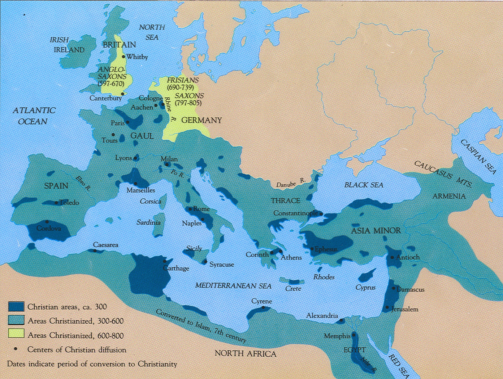

# 2.3. Rabinismo: Tanaj y Talmud (70-500)


<style>
.sidebar-index {
    border: 1px solid #ddd;
    background-color: #f9f9f9;
    padding: 10px;
    margin: 20px auto; /* Centrar el índice */
    width: 80%; /* O el ancho que prefieras */
    box-shadow: 0 2px 5px 0 rgba(0,0,0,0.16), 0 2px 10px 0 rgba(0,0,0,0.12);
}

.sidebar-index h2 {
    font-size: 20px;
    text-align: center; /* Centrar el título del índice */
    margin-top: 0;
}

.sidebar-index ul {
    list-style-type: none;
    padding: 0;
    text-align: left; /* Alinea los elementos del índice a la izquierda */
}

.sidebar-index li {
    padding: 8px;
    background-color: #f1f1f1;
    border: 1px solid #ddd;
}

.sidebar-index li:hover {
    background-color: #ddd;
}
</style>

<div class="sidebar-index">
    <h2>Índice</h2>
    <ul>
        <li><a href="#23-rabinismo-tanaj-y-talmud-70-500">2.3. Rabinismo: Tanaj y Talmud (70-500)</a></li>
        <li><a href="#la-primera-guerra-judía-66-73">La Primera Guerra Judía (66-73)</a></li>
        <li><a href="#el-sanedrín-de-yamnia-y-el-cierre-del-tanaj">El sanedrín de Yamnia y el cierre del Tanaj</a>
            <ul>
                <li><a href="#simón-i-ben-gamaliel">Simón I ben Gamaliel</a></li>
                <li><a href="#gamaliel-ii-90-100-una-figura-central-en-el-judaísmo">Gamaliel II (90-100): Una Figura Central en el Judaísmo</a></li>
            </ul>
        </li>
        <li><a href="#la-segunda-guerra-judía">La Segunda Guerra Judía</a></li>
        <li><a href="#rabí-áqiba-y-la-pre-cábala">Rabí Áqiba y la pre-Cábala</a>
            <ul>
                <li><a href="#discípulos-y-obras-de-akiva">Discípulos y Obras de Akiva</a></li>
                <li><a href="#influencias-neoplatónicas-y-neopitagóricas">Influencias Neoplatónicas y Neopitagóricas</a></li>
                <li><a href="#legado-y-significado">Legado y Significado</a></li>
            </ul>
        </li>
        <li><a href="#yehudá-ha-nasí-y-la-misná">Yehudá ha Nasí y la Misná</a>
            <ul>
                <li><a href="#simón-ben-gamaliel-ii-135-165">Simón Ben Gamaliel II (135-165)</a></li>
                <li><a href="#yehudá-ben-simón-165-219">Yehudá Ben Simón (165-219)</a></li>
            </ul>
        </li>
        <li><a href="#romanización-de-judea-y-galilea-en-el-siglo-ii">Romanización de Judea y Galilea en el siglo II</a></li>
        <li><a href="#romanización-de-los-judíos-de-la-diáspora-y-judaización-de-roma">Romanización de los judíos de la Diáspora y judaización de Roma</a>
            <ul>
                <li><a href="#fenómeno-de-judaización-de-roma">Fenómeno de judaización de Roma:</a></li>
            </ul>
        </li>
        <li><a href="#áreas-cristianizadas-hacia-el-año-300">Áreas Cristianizadas hacia el año 300</a></li>
        <li><a href="#el-judaísmo-de-los-amoraím">El judaísmo de los Amoraím</a></li>
        <li><a href="#antijudaísmo-constantino-306-337-y-los-judíos">Antijudaísmo: Constantino (306-337) y los judíos</a></li>
    </ul>
</div>


## La Primera Guerra Judía (66-73)


Tiene como fecha más relevante la destrucción del Templo y de Jerusalén en el 70. Surge a partir de un pogromo que hubo en Cesarea de población gentil que realiza una matanza de judíos durante el gobierno de Floro. Eso despierta la rebelión de Eleazar ben Ananías que era el lugarteniente del SS (el viceSS). El legado de la legión XII, gobernador de Siria, Galo, acudió a Jerusalén y fue derrotado. Con lo cual la rebelión se extiende. Surgen varios Mesías, zelotes, entre ellos un descendiente de Judas el Galileo (Eleazar), y otro como Simón bar Kojba. Hubo varios mesías que lucharon matándose entre sí y tal. 
¿Qué hacen los Flavios en Judea? La convierten en una provincia, con un legado propretor en Cesarea. 


## El sanedrín de Yamnia y el cierre del Tanaj

En un período crítico de la historia judía, marcado por la guerra y la transformación religiosa, emergieron dos eventos significativos que dieron forma al judaísmo como se conoce hoy: la creación del sanedrín de Yamnia y el cierre del canon del Tanaj. Estos acontecimientos no solo reflejaron los cambios en la práctica y la interpretación religiosa sino que también establecieron una base sólida para la evolución futura de la fe judía. Las figuras clave en estos eventos, como Simón I ben Gamaliel y su descendencia, jugaron roles fundamentales en estos desarrollos. La siguiente sección explora la vida y contribuciones de Simón I ben Gamaliel en este contexto histórico y religioso.

### **Simón I ben Gamaliel**

Simón I ben Gamaliel, hijo de Gamaliel I y nieto de Hilel, jugó un papel en la guerra del 50-70 y murió en Jerusalén. Gamaliel I tenía un hijo pequeño, Gamaliel II, quien se salvó de la muerte gracias a la profecía de Johanán ben Zakkai (JBZakkay) a Vespasiano.

**La Salvación de Gamaliel II y la Creación del Sanedrín**

Johanán, discípulo de Gamaliel I, escapó de Jerusalén fingiendo su muerte. Los zelotes le permitieron salir, y al entregarles a los romanos, Vespasiano le agradeció su profecía cumplida. Johanán pidió como recompensa que no mataran a Gamaliel II y que le permitieran crear un sanedrín en Yamnia, una ciudad gentil en la costa palestina. Vespasiano accedió y permitió la creación de este consejo de sabios, que incluía un tribunal y una escuela rabínicos.

**Relación con los Romanos**

Vespasiano no derogó el privilegio de los judíos de tener su propio sistema legal, pero sí les quitó el derecho de recaudar sus propios tributos (un privilegio concedido por Julio César). Además, ordenó que el didracma judío fuera destinado al templo de Júpiter Capitolino en Roma.

**Periodo de Crecimiento de Gamaliel II y Liderazgo de JBZakkay (70-90)**

Durante este tiempo, Gamaliel aún era un niño, y JBZakkay ejerció el liderazgo en Yamnia. Durante su jefatura, se decretó el cierre del canon del Tanaj, integrado por la Torá, los Nevim y los Ketuvim. Se excluyeron algunos libros presentes en el canon católico, como Tobías y Macabeos. Esta medida fue importante para crear una nueva religiosidad, ya que la anterior se basaba en el Templo.

**Relevancia de la Sinagoga**

La sinagoga, que existía antes, adquirió relevancia. Hasta ese momento, las sinagogas no estaban muy extendidas, pero ahora serían clave en la nueva religiosidad. La sinagoga se convirtió en una institución más de la diáspora, con la más antigua identificada arqueológicamente del II aec en Alejandría. También se cree que había sinagogas en Judea, Galilea y posiblemente en Antioquía.

Las sinagogas servían como habitaciones para recibir a los judíos de viaje, mostrando solidaridad, y también como escuela, no solo un lugar de oraciones y rituales. Los rabinos hicieron de la sinagoga un lugar exclusivo para aquellos que admitían sus ideas.

**Conclusión**

El periodo descrito marca el nacimiento del judaísmo tal como se conoce hoy. No es el judaísmo de los saduceos, fariseos, esenios o cristianos, sino un nuevo judaísmo talmúdico desarrollado a partir de ese momento. La sinagoga se erigió como un elemento clave en la nueva religiosidad, enfatizando la enseñanza, la oración y la solidaridad comunitaria.

        
### **Gamaliel II (90-100): Una Figura Central en el Judaísmo**

**Introducción**
Gamaliel II, que vivió entre los años 90 y 100, jugó un papel fundamental en la evolución del judaísmo. Era descendiente de Hilel y nieto de Gamaliel I, famoso por defender a los cristianos y por haber sido salvado de la muerte gracias a un favor de Vespasiano a Johanán Ben Zakkai.

**Políticas y Contribuciones**
Gamaliel II llevó a cabo varias políticas importantes dentro de la corriente rabínica farisea. Fusionó las escuelas de Hilel y Shammai, creando unidad frente a otras corrientes. Aunque provenía de la escuela de Hilel, aceptó algunas ideas de Shammai, que era más riguroso y antigentil.

Se le atribuye la Birká Ha Minim, una bendición contra los herejes y los nazarenos, recitada por un rabino llamado Samuel el Pequeño. Los textos encontrados de esta bendición varían, incluyendo solo a los minim en algunos y a los nosrim en otros. La inclusión de los nosrim indica que no eran considerados herejes.

**Desarrollo del Concepto de Herejía**
En esta época, el concepto de hereje comenzó a desarrollarse. Aeresis en griego se refería a una corriente de opinión diversa, como heterodoxia. Sin embargo, surgió una religiosidad dogmática que no admitía diversidad de opiniones. Esto se evidencia en la condena a los minim, probablemente saduceos, conectada con la bendición que hablaba de la resurrección de los muertos.

**Relaciones con los Nazarenos y Judeocristianos**
La redacción con la palabra nosrim llevó a la condena de los nazarenos, y su entrada en la sinagoga fue prohibida. Es plausible que los judíos rabínicos recitaran esta bendición para evitar la entrada de judeocristianos a las sinagogas rabínicas, una práctica que no estaba claramente separada hasta entonces.

**Rol en Roma y Liderazgo Judío**
Gamaliel adquirió relevancia al ser enviado a Roma en torno al 95/96 tras la muerte de Agripa II. La literatura rabínica considera que entonces se instauró el patriarcado judío, otorgando a la casa de Hilel la primacía sobre el resto de los judíos por parte de los romanos. Hubo noticias de una destitución provisional por su autoritarismo, pero luego volvió al poder.

**Muerte y Sucesión**
Murió entre el 110 y el 115. En el 115 se produjo la segunda guerra judía en época de Trajano, y no hay constancia de que Gamaliel II viviera en esa época. Tampoco se sabe con certeza quién lo sucedió.

## La Segunda Guerra Judía


La Segunda Guerra Judía, también conocida como la Guerra de Kitos (115-117), se debió a la expansión del Imperio Romano bajo Trajano, quien estaba conquistando Mesopotamia. Trajano, el conquistador romano que había extendido al máximo el Imperio tras conquistar Dacia y adquirir un tesoro enorme, también incorporó la Arabia Nabatea. Ahora se lanzaba a conquistar Mesopotamia, siguiendo los pasos de Craso y Marco Antonio. Trajano derrotó a los partos (persas) y arrebató todo Mesopotamia (MP).

Durante la conquista de Mesopotamia desde Antioquía, se produjeron pogromos en Cirene (Libia) y en Chipre. Según fuentes romanas y cristianas, Lucas Andreas lideró legiones de judíos que tomaron Alejandría y realizaron una matanza enorme de gentiles griegos. Luego, la rebelión se extendió a Chipre, dirigida por Artemión, y también a MP y Judea.

En Mesopotamia, existía un territorio al norte totalmente judío, el reino de Adiabene. Su reina Hlenea se había convertido al judaísmo y tenía un palacio en Jerusalén. Trajano conquistó este territorio, pero mientras estaba en el Golfo Pérsico, le sorprendió la rebelión de los judíos de Mesopotamia. Cuatro provincias romanas se rebelaron simultáneamente, algo nunca antes visto en el Imperio.

La guerra de Kitos fue liderada por Lusio Quietus, un legado legionario y senador mauritano muy sanguinario, mano derecha de Trajano. Trajano abandonó Mesopotamia y regresó a Roma, temiendo más rebeliones. Murió en el camino, y le sucedió Adriano, también de Itálica y gobernador de Siria. Adriano destituyó a Quietus y pacificó Judea.

Adriano inició una política de apaciguar las provincias, gastando el tesoro de Trajano en obras públicas. Cambió la iconografía imperial y benefició a las provincias mediante la construcción de ciudades, acueductos, murallas, y más. Esta política tuvo éxito, y la economía creció. Mesopotamia fue abandonada por Trajano y recuperada por los partos.

Adriano también actuó en favor de Judea, permitiendo la reconstrucción del templo. Comenzó la reconstrucción de Jerusalén en 117, pero en 130 ordenó construir un templo a Zeus Hypsistos en la explanada del templo, ofendiendo a los judíos. Esto llevó a la rebelión de Bar Koshiba.

Existen fuentes que hablan de una prohibición de la circuncisión, pero esto no es cierto. Adriano pudo haber interpretado la ley romana con rigor, limitando el proselitismo, aunque es dudable que esto fuera la causa de la guerra.

En resumen, la Segunda Guerra Judía fue un conflicto complejo y multifacético, que reflejó la expansión romana, las tensiones religiosas, y las políticas cambiantes de los emperadores Trajano y Adriano.


## Rabí Áqiba y la pre-Cábala        

El siglo II d.C. fue testigo de un momento crucial en la evolución del pensamiento judío, marcado por la revuelta de Bar Kosiba. Los cristianos y los rabinos jugarán con su nombre y transformarán -sh- en -j- (Bar Kokhba: hijo de la Estrella: mesianismo) debido a una profecía en Malaquías (?) que el mesías sería profetizado por una estrella. Akiva consideró a Bar Kokhba como el mesías, aunque otro rabino exclamó: "Ákiva, crecerá la hierba en tu barba antes de que veas al Mesías."

Tras la derrota, Adriano reconstruyó Jerusalén como una colonia romana (Elia Capitolina) con templos a Júpiter Capitolino, Júpiter-Serapis, y un templo a Isis-Venus en la gruta del Gólgota donde teóricamente había sido enterrado Jesucristo. Refundó Séforis como Diocesarea (de Zeus y el César) y reconstruyó el templo de Samaria consagrado a Zeus Hipsistos. Prohibió la entrada de judíos en Jerusalén, y la provincia pasó a llamarse Palestina, provocando una emigración masiva a Galilea.

### Discípulos y Obras de Akiva

Akiva dejó una profunda impronta a través de sus enseñanzas y discípulos, incluyendo a R. Meir y Simeón bar Yojai, supuesto autor del Zohar (escrito en realidad en época medieval). A Akiva se le atribuyen obras como las _Letras de R. Akiva_, el _Séfer Yetzirá_ (libro de la formación), y el _Libro de las Letras de Abraham_, donde aparecen por primera vez las 12 sefirot.

La mishná de YHN introduce figuras importantes en la tradición judía como Bar Kotsiba, Rabí Ákiva, Rabí Meir, y Simón bar Yojai. Este último es el supuesto autor del Zohar, aunque en realidad fue escrito en la época medieval. Estos maestros tuvieron un papel clave en la formación del judaísmo fariseo y en la redacción de la Misná.

Rabí Ákiva es atribuido con obras como las Letras de Rabí Akiva y el Séfer Yetzirá (libro de la formación), y el libro de las letras de Abraham, donde aparecen por primera vez las 12 sefirot.

Las Sefirot son emanaciones de Dios y reflejan una influencia neoplatónica en el pensamiento judío. Estas hipóstasis que emanan del Uno incluyen el verbo, la inteligencia, la belleza, la sabiduría, etc. Esta idea de emanaciones también se encuentra en figuras como Filón, y en el cristianismo gnóstico.

El conocimiento de las sefirot permitiría al sabio acceder a Dios, ascendiendo por las emanaciones más sencillas hasta las más complejas. La palabra "Sefirot" puede traducirse como cifras, y hay una fuerte especulación sobre los números y matemáticas en este pensamiento filosófico-mágico, incluyendo el valor numérico de los nombres en hebreo.

Esta influencia numérica también se relaciona con el neopitagorismo, una corriente filosófica de la época que, al igual que el pensamiento precabalístico, defendía la transmigración de las almas. En conjunto, estos elementos reflejan una confluencia de ideas y tradiciones en la formación de la cábala y la filosofía judía en este período.

### Influencias Neoplatónicas y Neopitagóricas

Las Sefirot reflejan la influencia neoplatónica y neopitagórica, como la creencia en la transmigración de las almas. En todo este pensamiento filosófico-mágico ("poco racional, más mágico que otra cosa" según Pedro), se especula sobre cifras y matemáticas, como en el Apocalipsis de Juan con el número de la bestia.

### Legado y Significado

Las ideas precabalísticas en torno a R. Akiva constituyen el germen a partir del cual florecería la Cábala. A pesar de la ejecución de Akiva y la derrota de Bar Kokhba, su legado continúa siendo una parte vital de la herencia cultural y religiosa judía.

Este período de gran cambio y desarrollo fue influenciado por corrientes filosóficas contemporáneas, y los escritos y enseñanzas de Akiva y sus discípulos dejaron una huella duradera que resonó en la tradición judía a través de los siglos.

## Yehudá ha Nasí y la Misná

### **Simón Ben Gamaliel II (135-165)**

**Traslado del Sanedrín a Usha, Galilea**: Durante su período de liderazgo, Simón Ben Gamaliel II trasladó el sanedrín a Usha en Galilea, transformando la región en una ciudad de mayoría judía.

### **Yehudá Ben Simón (165-219)**

Conocido también como ha-Nasí (el presidente, caudillo, dirigente, jefe), ha-Kados o Rabbenu (nuestro maestro), Yehudá Ben Simón realizó contribuciones significativas:

1. **Nombramiento como Patriarca**: Fue nombrado patriarca por el emperador romano Antonino Pío, quien también le concedió el didracma.
2. **Traslado del Sanedrín**: Trasladó el sanedrín a Séforis y Bet She'Arim.
3. **Último de los Tanaim y Primero de los Amoraim**: Fue el último de los tanaim (rabinos del sanedrín) y el primero de los amoraim (comentaristas de la Misná).
4. **Redactor de la Misná**: Organizó la Misná en tres órdenes principales:

**a. Orden Primero, Semillas (Zeraim)**: Relacionado con la ley agraria y el código mercantil/fiscal.

* **Berajot (Bendiciones)**: Exceptuando una bendición de los campos, se enfoca en oraciones como Shemá, Amidá, comidas y oraciones especiales.
* **Peá (Esquinas del Campo)**: Regula dejar partes del campo sin cosechar para los pobres.
* **Demay (Producto de Diezmo Dudoso)**: Porcentaje para sacerdotes de productos adquiridos a judíos impuros que no pagaban los diezmos.
* **Kilayim (Especies Diversas)**: Prohibiciones y normas agrarias sobre mezclar especies diferentes.
* **Sheviit (Año Sabático)**: Actividades agrarias permitidas durante el año sabático en Israel, con excepciones como el trigo, la vid y el olivo.
* **Terumot (Ofrendas), Maaserot (Diezmos), Maaser Shení (Segundo Diezmo), Jalá (Masa), Orlá (Árboles Frutales Incircuncisos), Bikkurim (Primicias)**: Tratados sobre impuestos e impuestos de productos agrarios.

**b. Orden Segundo, Fiestas (Moed)**: Regulaciones y observancias de las fiestas judías.

* **Shabbat (Sábado)**: Rigor en las prohibiciones durante el sabbat.
* **Eruv (Fusión)**: Fusión de familias en una ínsula o plaza para el sabbat, creando una estructura de barrio.
* **Pesajim (Pascua)**: Normas sobre la Pascua, incluyendo sustancias fermentadas, asar el cordero, etc.
* **Shekalim (Siclos)**: Trata sobre el didracma, un imuesto templario en Galilea.
* **Fiestas Austeras**: Incluye Yom Kipur, Días intermedios, Rosh Ha Shaná, Días de Ayuno.
* **Meguilá (Rollo de Esther)**: Reglas sobre Purim y la lectura anual de la Torá.
* **Prohibiciones en Fiestas Menores y Sacrificios Festivos**.

**c. Orden Tercero, Mujeres (Nashim)**: Aspectos legales relacionados con las mujeres.

* **Yehamot (Cuñadas)**: Matrimonio levirato para proteger a las viudas.
* **Ketubot (Documento Matrimonial)**: Contratos matrimoniales, influenciados por la ley romana.
* **Nedarim (Votos)**: Consagración y prohibición de bienes, y anulaciones de votos femeninos.
* **Nazir (Nazireato)**: Voto de abstinencia y anulaciones femeninas, con implicaciones en la historia cristiana. Cf. Debate Jesús Nazareno por Nazaret o por Nazir.

```
No hay ningún texto ni resto arqueológico que demuestre la existencia de Nazaret antes de era cristiana. Es normal, los restos arqueológicos son del siglo II...
```

* **Sotá (Sospechosa Adúltera)**: Rito de aguas amargas y uso de la lengua hebrea.
* **Guittin (Documento de Divorcio)**: Normas sobre el divorcio y repudio.
* **Kidushin (Esponsales)**: Contrato prematrimonial.

**d. Nezikin (Daños)**:
   - Trata de la ley civil y criminal, incluyendo las leyes de daños y robos, y las regulaciones éticas en los tratados de Avot.

**e. Kodashim (Cosas Sagradas)**:
   - Se ocupa de los sacrificios del Templo, las leyes de pureza e impureza en el Templo, y los detalles de las ofrendas y sacrificios.

**f. Taharot (Purezas)**:
   - Trata de las leyes de pureza e impureza, incluyendo las leyes de pureza ritual.


## Romanización de Judea y Galilea en el siglo II

Pedro criticó la idea de una intensa romanización de Galilea en tiempos de Jesús, señalando que la verdadera romanización ocurrió en el siglo II bajo Adriano. Adriano, conocido por sus habilidades urbanísticas, transformó Séforis y Jerusalén en ciudades mercantiles. Este desarrollo incluyó calles porticadas, las cuales cumplían una función estética y práctica al facilitar el movimiento de mercado. 

Esta época se caracteriza también por la presencia de mosaicos tanto en viviendas privadas como en sinagogas judías, lo cual es notable considerando la larga tradición de aniconismo judío. Aunque el mosaico no fue completamente prohibido por la ley judía, su adopción muestra una notable influencia romana.

## Romanización de los judíos de la Diáspora y judaización de Roma

Este fenómeno fue incluso más significativo que la romanización en Galilea. Por todo el Mediterráneo, y en especial en Roma, la presencia judía se hizo prominente, especialmente tras las tres guerras y la conquista de Pompeyo en el 63 a.C., que resultó en la venta de miles de judíos como esclavos.

En Roma, donde había múltiples sinagogas, la presencia judía era importante. La mayoría de los textos judíos en la ciudad (epígrafes, lápidas) estaban en griego, con algunos en latín y muy pocos en hebreo, reflejando un alto grado de helenización y romanización entre los judíos, especialmente aquellos de regiones como Asia, Éfeso, Pérgamo y Mileto.

### Fenómeno de judaización de Roma:

Las clases inferiores romanas mostraban simpatía hacia los judíos, un pueblo de esclavos liberados que resistía culturalmente a la dominante aristocracia. Esta simpatía a menudo llevaba a conversiones, fenómeno notado por personalidades como Séneca, quien se quejó de que todos celebraban el sábado en la época de Nerón.

Esta "judaización" de Roma no consistía solamente en la adopción de prácticas religiosas judías, sino también en una identificación con la legislación social judía, que difería notablemente de la romana. Personajes notables de la época, como Popea (esposa de Nerón), Flavio Clemente (ejecutado por Domiciano) o su mujer [Domitila](https://pt.wikipedia.org/wiki/Catacumba_de_Domitila), son ejemplos de esta influencia. O sea que incluso dentro de la corte imperial, se observó un proceso de judaización o cristianización, ya que la cristianización, en el fondo, es una judaización. Los primeros escritores romanos que hablan del cristianismo hablan de que se está difundiendo una ***superstitio* judía**.

```
Superstitio: cualquier culto extranjero de pueblos que no sean romanos.
```

## Áreas Cristianizadas hacia el año 300


Las áreas oscurecidas en el mapa indican las regiones cristianizadas alrededor del año 300. Estas áreas coinciden en gran medida con lugares que tenían una significativa población judía. En particular, en Oriente, incluyen:

- Siria-Palestina
- Damasco
- Antioquía
- Chipre
- Egipto
- Parte de la provincia de Asia (con Éfeso como capital)
- Algunos puntos de Grecia
- Desde Roma hasta Nápoles, abarcando toda la Campania.

Además, hay tres zonas importantes fuera de este núcleo oriental:

- Cartago
- La Bética
- La actual Provenza (antiguamente conocida como la provincia de Septimania, en la Galia).

La cristianización de tanto el norte de África como de la Bética puede estar influenciada por las guerras judeorromanas. Se menciona que la Décima Legión, que se asentó en Jerusalén tras la destrucción del templo, estaba compuesta en parte por soldados mauritanos e hispanos, lo que podría haber conducido a la venta de esclavos judíos en estos territorios, aunque esto es solo una hipótesis.

La presencia judía en estos territorios en la antigüedad, especialmente en los siglos II y III, es un hecho constatado. La presencia judía en otros lugares fue más tardía. Por lo tanto, no es sorprendente que las ciudades más cristianizadas fueran también los lugares donde se establecieron los primeros obispados.

## El judaísmo de los Amoraím

En el siglo III, después de Yehudá Ha Nasí, Gamaliel III trasladó el Sanedrín a Tiberíades, marcando el inicio de su importancia como centro del judaísmo talmúdico que se mantendría durante toda la antigüedad y los primeros siglos de la Edad Media, incluso tras la llegada de los musulmanes. Tiberíades, manteniendo su estatus de ciudad relevante del antiguo reino de Israel, se convirtió en un centro destacado para el judaísmo, con la presencia de un Sanedrín y diversas escuelas.

Actualmente, Tiberíades sigue siendo una ciudad significativa para la cultura judía, reconocida por sus monumentos dedicados a sabios judíos de la antigüedad y del siglo XVI. Durante este último periodo, muchos sabios judíos, trasladándose de Sefarad a Galilea, establecieron escuelas cabalísticas que promovieron la difusión de la Cábala por Oriente.

Por otro lado, uno de los discípulos de Yehudá Ha Nasí, **Rav**, regresó a su tierra natal, Babilonia, llevando consigo la Misná. Desde el siglo V a.C., Babilonia albergaba una numerosa comunidad judía. Rav fundó una **academia en la ciudad de Sura**, convirtiéndola en un centro de difusión del judaísmo misnaico. Es relevante notar que el judaísmo en Mesopotamia probablemente mantenía fuertes conexiones con el judaísmo del Segundo Templo, aunque la información sobre los judíos en Babilonia durante los siglos I y II es limitada.

En la segunda generación de los **Amoraím** (250-290), Johanán bar Nafja, director del Sanedrín de Tiberíades, redactó la mayor parte de la Guemará Palestina, componente que, junto con la Misná, forma el Talmud. Para finales del siglo III, el Talmud de Palestina, también conocido como Talmud de Jerusalén (aunque Jerusalén no pinta nada aquí porque era una ciudad politeísta, Ennia Capitolina), estaba ya formado. En esta misma época, también se escribió la Toseftá en Tiberíades, Galilea. La Toseftá, compilada por Hiyya bar Abba (*hijo del padre*, como Barrabás, es una especie de título honorífico), no forma parte del Talmud sino que se desarrolla paralelamente. Son otro tipo de comentarios con más **hagadá** (narraciones explicativas) que **halaká** (comentario jurídico).

En la cuarta generación (320-350) tenemos a **Hilel II**, crador del actual calendario hebreo. El calendario que tenemos en la Biblia remitía a 4000 años antes de la Hanukká (la liberación del templo por Judas Macabeo). En cambio, con el ajuste que hace Hilel II del cómputo de los años y la compatibilidad de los calendarios lunar y solar se queda el calendario actual judío.

En las sexta y séptima, IV y V: **Guemará de Babilonia** por Rav Ashi (terminada por Ravina II). Esta Guemará, más tardía, es menos acercada a los textos pero más completa, exhaustiva. Comenta muchos más tratados que la de Palestina. Por este motivo y otros (relacionados con la historia de los judíos en la E. M.), el Talmud de Babilonia se difundirá mucho más que el de Palestina.

## Antijudaísmo: Constantino (306-337) y los judíos

Antes de la era de Constantino, no existía un antijudaísmo estatal. Aunque algunos autores criticaban a los judíos, lo hacían en el mismo tono que criticaban a los egipcios y otros pueblos. Sin embargo, con el triunfo del cristianismo, comenzó a surgir una legislación antijudía oficial, promovida por ciertos padres de la iglesia y obispos importantes, lo que llevó a la propagación de un antijudaísmo significativo y finalmente a la persecución de los judíos.

En la legislación de Constantino, específicamente en el Código Teodosiano (C.T. 16, 8, 1), se prohíbe la lapidación de los judíos conversos al cristianismo, bajo pena de hoguera. Esta ley estaba dirigida contra las autoridades judías de las sinagogas que ordenaban la lapidación de los judíos convertidos al cristianismo, protegiendo así a los conversos cristianos y limitando la autonomía judicial judía.

Por otro lado, en el C.T. 16, 8, 2-4, se otorgan exenciones fiscales a ancianos judíos, sacerdotes y archisinagogos entre los años 321 y 331, un privilegio similar al concedido a los cristianos, que beneficiaba a los altos cargos de la comunidad judía.

Finalmente, en el C.T. 19, 9, 1, una ley del año 336 ordena la liberación de los esclavos no judíos que fueran circuncidados por amos judíos, permitiendo que estos se conviertan en libertos y limitando así la judaización. De esta manera, en la época de Constantino, las leyes muestran tres enfoques distintos: la protección de los cristianos frente a los judíos, la concesión de privilegios a las autoridades judías y la limitación del proselitismo judío.

Los hijos de Constantino sí que empiezan a legislar con leyes antijudías (339):

- Prohibición de poseer esclavos cristianos o gentiles y de convertir o desposar mujeres cristianas (C.T. 16, 9, 2 y C.T. 16, 18, 6).
- Aquí se produce una pequeña revuelta judía: Rebelión de Isaías de Séforis y su mesías Natrona contra Constancio Galo (hermano de Juliano el Apóstata) en 351.
- Confiscación de bienes al que se convierta al judaísmo en 352 (C.T. 16, 18, 7)

## Antijudaísmo de Teodosio (378-392)

A finales del siglo IV, la situación de los judíos se agrava aún más:

- En 383, una ley exige que todo líder judío, al igual que los sacerdotes cristianos, debe nombrar un sustituto para sus funciones decurionales, revocando así las exenciones fiscales previamente concedidas por Constantino. Esto implicaba que debían asegurar la continuidad de las obligaciones fiscales, llegando incluso a asumirlas con sus propios bienes debido a la ruralización del Imperio y la crisis económica, que causaba una huída generalizada de las responsabilidades fiscales.

- En 384, se prohíbe a los judíos poseer esclavos cristianos y convertir a cristianos al judaísmo. Esta ley reitera prohibiciones anteriores, posiblemente en respuesta a las políticas más liberales de Juliano el Apóstata, quien había prometido reconstruir el templo de Jerusalén y era conocido por su postura anticristiana (de hecho prometió reconstruir el Templo de Jerusalén porque era anticristiano o, como decía él, "antigalileo").

- En 388, el matrimonio entre judíos y cristianos es considerado adulterio, un delito que en la tradición bíblica podría ser castigado con la muerte. En el mundo cristiano, no en el romano, se podía matar a una mujer por adulterio. De hecho, la última ejecución por adulterio en Sevilla fue en el siglo XVII. Este año (388) también se destaca por la prohibición de realizar debates públicos sobre religión y por el incidente del incendio de la sinagoga de [Calínico](https://repositorio.unican.es/xmlui/bitstream/handle/10902/26393/Rodr%C3%ADguezTer%C3%A1nFrancisco.pdf?sequence=1): tras el incendio provocado por el pueblo cristiano Teodosio ordena reconstruir la sinagoga pero Ambrosio de Milán, uno de los obispos más influyentes del Imperio Romano Occidental, se opone a esta medida y presiona a Teodosio para eximir al obispo responsable del acto. Finalmente, Teodosio cede ante la presión y termina pidiendo perdón a Ambrosio, evidenciando la influencia de la iglesia en las decisiones imperiales y la creciente hostilidad hacia los judíos.

- En 393 decretó de nuevo la prohibición de asaltar sinagogas.

## Antijudaísmo en la Tardoantigüedad

**San Ambrosio** destaca como uno de los padres de la Iglesia con un enfoque particularmente fuerte hacia el antijudaísmo, una postura que también adoptará su discípulo **San Agustín**. Antes de su conversión al cristianismo, San Agustín exploró otras filosofías, siendo inicialmente neoplatónico y posteriormente maniqueo. En el Oriente, se encuentra **Juan Crisóstomo**, de Antioquía (Siria), quien también redactó un tratado completo contra los judíos.

Este período marca el desarrollo de la literatura antijudía cristiana y representa un punto de inflexión después del cual el antijudaísmo comienza a intensificarse significativamente.

En el Occidente romano, esta tendencia antijudía persiste hasta la llegada de los pueblos bárbaros (406-476). La llegada de los visigodos a Hispania marca un endurecimiento en la postura contra los judíos, con los Concilios de Toledo estableciendo legislación severa en su contra.

La situación era incluso más grave en Bizancio: 
- En 415, el emperador Teodosio II despojó al Patriarca Gamaliel VI del título de Prefecto Honorario.
- Tras la muerte de Gamaliel VI en 425, el patriarcado fue abolido y el tributo del didracma fue incorporado a la fiscalidad bizantina.
- Bajo el reinado de Justiniano (527-565), se prohibieron las reuniones del Sanedrín y el uso del idioma hebreo.
- Avanzando hacia la Edad Media, en el siglo VII, todos los judíos fueron expulsados de Bizancio.

## Conclusiones sobre la Edad Antigua

- En este período se forma el judaísmo tal como lo conocemos, tanto por sus creencias (basadas en el Tanak, el Talmud y, para los iniciados, el Libro de la Formación), como por su calendario de fiestas y los ritos de la sinagoga.
- Desaparece la pluralidad filosófica en beneficio de un pensamiento único religioso. Vimos como con la _Birkat haMinim_ se tiende a suprimir la pluralidad de ideas.
- A finales de este período surge la palabra "Yahadut", actualmente traducida como "judaísmo" o "religión judía", pero que al principio significaba más bien "judaidad", cualidad de judío, y sólo a partir del siglo XV "religión". Estamos ya ante un judaísmo que utiliza nuevos términos para definir lo que es judío y lo que no (a partir del s. XV este término se traducirá por "religión judía"). Algo que no está claramente definido en este momento: que haya un concepto de religión judía como lo que define al judío, sino que había múltiples aspectos: religión, lo político, lo social, la economía, la cultura en general. Múltiples que lo convierten en un grupo étnico. Todavía no puede considerarse que los judíos se definen exclusivamente en términos religiosos.
- Aunque se convierten en una minoría étnica, nunca desaparece su definición como pueblo ni su conexión espiritual con el territorio. Todavía, cuando dos judíos se despiden, se encuentran en un camino, lo hacen con la frase "el año que vienen en Jerusalén".
- A finales de la Antigüedad, el cristianismo profesa el antijudaísmo.
 
---

<div style="display: flex; align-items: center; float: left;">
<a href="judaismo/apuntes/jdmo_t2-2.md">&#8592; volver a tema 2.2</a>
</div>
