# El judaísmo contemporáneo

## Siglo XIX

**Entre la emancipación, la reacción y el antisemitismo**

Es una continuación de lo que ya habíamos visto en el XVIII, con las dos grandes corrientes ortodoxia-haskalá (jaredíes vs reformados).

En las etapas anteriores habíamos visto el antijudaísmo romano, el antijudaísmo medieval. El concepto de antisemitismo se puede aplicar únicamente a partir de ahora. Antes se rechazaba a un grupo religioso. El antisemitismo es un rechazo racista (no a un grupo racial, porque los judíos eran de diversos orígenes raciales, sino de índole ideológicamente racista).

### La Emancipación en Estados Unidos

La emancipación en Estados Unidos representa un proceso histórico de otorgamiento de igualdad de derechos a todos los ciudadanos, independientemente de su identidad. Este proceso, que ha tenido lugar en diversos contextos, incluye la emancipación de los esclavos, de las mujeres, y de los judíos, cada uno siguiendo su propia trayectoria hacia la igualdad de derechos.

La emancipación de los esclavos es notablemente recordada por su culminación en los años 60 con Abraham Lincoln y la Guerra de Secesión. Paralelamente, el movimiento por la emancipación de las mujeres ganó impulso después de la Convención de Seneca Falls, con mujeres quáqueras que, tras luchar por la emancipación de los esclavos, enfocaron sus esfuerzos en la lucha por los derechos de la mujer.

En el caso de los judíos en Estados Unidos, el país ofreció un grado de emancipación sin precedentes, naciendo de la primera democracia que promovía "cierta" igualdad de derechos. La diversidad religiosa de los inmigrantes europeos, incluyendo anglosajones anglicanos (episcopalianos post-independencia), presbiterianos, menonitas, amish, bautistas, y católicos, contribuyó a establecer un entorno de libertad religiosa y de igualdad ante la ley, extendiéndose también a los judíos.

Los judíos estuvieron presentes en Estados Unidos desde sus inicios, con 23 judíos de origen sefardí viviendo en la colonia holandesa de Nueva Ámsterdam (Manhattan) antes de su conversión en Nueva York por los ingleses en 1664. En 1696, la familia madrileña Gómez, conversos al cristianismo, llegó a Nueva York, aprovechando la tolerancia y oportunidades económicas para asentarse y contribuir a la construcción de la primera sinagoga en 1730 para los 300 judíos de la ciudad. A pesar de esta tolerancia, los judíos inicialmente no tenían permitido votar en elecciones locales hasta la revolución americana.

Para 1733, unos 42 sefardíes portugueses se establecieron en Georgia y, para 1775, había aproximadamente 5000 judíos en las 13 colonias, la creciente tolerancia facilitó el aumento de la población judía, aunque todavía enfrentaban ciertas restricciones.

Este proceso de emancipación en Estados Unidos ilustra el progreso hacia una sociedad más inclusiva y equitativa, destacando el papel significativo de los judíos en el desarrollo de la nación.

Participarán en la Guerra de Independencia de los Estados Unidos entre 1775-1783. Esto les será reconocido, cuando se haga la constitución en el 87, cuando se proclama la igualdad de los ciudadanos. Ya en 1791 se hará la primera enmienda, de esa constitución: prácticamente la carta de derechos. La constitución americana es la más longeva del mundo, todavía la estructura no estaba generalizada como hoy, que ya está clara cierta estructura repartida entre una parte dogmática (de valores) y una orgánica.

En la Declaración de Derechos del 91 ya se establece la igualdad de todos los grupos religiosos.

En 1813, Mordecai Noah ya es cónsul de Estados Unidos (el primer cónsul judío) en Túnez, luego director del *National Advocate* y en 1820 Sheriff de NYC, la ciudad con mayor concentración de judíos.

En 1825 había 250k judíos y en 1908 ya había 1,8M:un tercio de lo que había en Europa Oriental. La mayor parte de la población judía mundial de entonces estaba concentrada en las zonas de residencia judía creadas por Catalina la Grande.

### La Emancipación en Europa

Comenzará en Austria. José II de Austria, habsburgo, promulgará unas leyes bastante avanzadas para esa época. Vale que no hubiera igualdad total, de hecho había unos deseos de que los judíos se asimilaran a la población no judía de europa, pero por lo menos estamos hablando de algo bastante avanzado. Además, Austria había adquirido colonias de la confederación Polaco-Lituana y estaba poblada con bastantes judíos.

Hay que esperar a la Revolución Francesa para el primer estado europeo con igualdad para los judíos.
La consistución y el régimen (monarquía parlamentaria).
    Asamblea (1798)
    Ley sobre los judíos (1791): decreta su libertad e igualdad con respecto al resto de franceses
    Sin embargo, al año siguiente, 1792-94, llega el período Terror, se proclama la república, se ejecuta a Luis XVI y los jacobinos de la república (aunque fuera democrática en el sentido de sufragio universal, no lo fue tanto en sentido de libertad de expresión). Se utilizó para ejecutar a judíos que no querían asimilarse al francés en todos los sentidos. Fue en aquella época cuando también se proclamó la *Diosa Razón*, cuando se persiguió más duramente al clero católico francés... y lo mismo ocurre con el rabinato, que también experimentará un acoso y una persecución por parte de las autoridades del Terror. Sobre todo los askenazíes. Ya vimos que en burdeos estaban los sefardíes de carácter progresista, económicamente más prósperos y más abiertos y por otro lado los askenazíes de alsacia y lorena que eran más campesinos, más artesanos de carácter tradicional, menos próspero, más pobres y más conservadores con esa mentalidad, ese judaísmo místico askenazí que había nacido en la edad media: muy riguroso en cuanto a costumbres, etc. Estos askenazíes no querían asimilarse, convertirse en ciudadanos franceses iguales a los católicos o hugonotes.
    La situación mejora a partir del 1794-9, con la caída de [Robespierre](https://es.wikipedia.org/wiki/Maximilien_Robespierre) y la proclamación de la Convención. Vuelve la libertad religiosa y se tranquiliza la situación. Los juidíos franceses se sitúan de una manera más tranquila y sosegada.

Con Napoleón también. Él incluso reconoció autoridades como el Gran Sanedrín. También conquistó territorios de toda Europa doinde había población judía importante. igual que negoció con el Papa para crear una especie de concordato, de igual manera negoció con los judíos para crear el Gran Sanedrín. Hay que tener en cuenta que territorios importantes como Venecia, Holanda, Polonia (incorporado el gran ducado de polonia al imperio francés) van a experimentar un progreso relevante para la población judía durante la invasión napoleónica.

Con el Congreso de Viena, tras la derrota de Napoleón en 1815, tenemos una vuelta atrás. Se retorna al Antiguo Régimen, con matices. En algunos estados (la francia borbónica de la restauración), no hay grandes retrocesos.

#### Expansión de la emancipación

Sobre todo a través de las revoluciones liberales. Tres grandes oleadas: 1820 (países del sur de europa), 1830 (europa occidental y central) y 1848 (toda europa). Gracias a estas revoluciones comienzan a expandirse esta legislación igualitaria en la que ser judío se convierte en una cosa religiosa y no nacional/étnica. En este contexto se considera que todos los que adquieren la carta de naturaleza por haber nacido en una nación son ciudadanos y por tanto miembros de una nación y con soberanía nacional, pero ahora los ciudadanos tienen **libertad** para profesar la religión que deseen o para no practicar ninguna. Este es el espíritu de los estados liberales, que supone igualdad, integración de los judíos en la sociedad. Ahora podemos encontrar figuras de judíos nacionalistas de sus países (judíos italianos nacionalistas italianos, franceses, británicos, incluso alemanes).

Esto choca con la visión que tenemos del siglo XX pero es la realidad del XIX, una realidad extendida, no unánime, pero sí mayoritaria. También había judíos que no compartían eso del nacioanlismo, los estados-nación que se están formando, etc. Hay tres grandes excepciones:

- El Papa: el estado pontificio (auqí no hay emancipación)
- Prusia: hasta 1869. Caso de Karl Marx, cuyo padre se tuvo que convertir al luteranismo para ascender en la carrera profesional como abogado del Estado. De ahí le vino a él una educación no-religiosa y acabó siendo materialista histórico. Esto fue antes, Marx estuvo en los 40 en la Universidad de Berlín, lo llamaban el "moro"?
- Rusia, se mantiene prácticamente hasta 1917, la Revolución Soviética, la marginación de los judíos.

Durante este periodo, la familia Rothschild se expande por Austria, Francia e Inglaterra. Son banqueros austriacos que crean una red internacional con ramas de la familia segregadas que crean entidades bancarias importantes en esos países. Se benefician del apoyo mutuo judío que sigue existiendo en este siglo igual que en los anteriores. Esto les permite prosperar considerablemente y crear una entidad bancaria muy vasta y poderosa que, al extenderse por varios países, da pie a ciertas teorías conspiranoicas. Esto son factores que van a influir en la creación de teorías antisemitas.

En EEUU también tenemos una pequeña crisis en 1862, en plena Guerra de Secesión, el general Grant decretó la expulsión de los judíos. Luego se abolió. 

> Como se ve, el fenómeno de la emancipación no deja de ser frágil. La toma del capitolio por las hordas trumpistas tras la victoria de Biden, allí había una persona con una camisa antisemita promoviendo el holocausto. Por lo que la presencia del antisemitismo, la fragilidad de la emancipación, pervive.

##### El Programa de Pittsburgh

**Modernización y reforma en el judaísmo estadounidense**

El Programa de Pittsburgh de 1885 representa un hito en la historia del judaísmo estadounidense, marcando un camino hacia la integración y modernización religiosa y social, inspirado en los ideales de la Haskalá. Este programa abogó por una plena identificación de los judíos norteamericanos con la nación estadounidense, no solo como ciudadanos sino también como parte activa y solidaria de la sociedad, independientemente de las diferencias religiosas.

**Integración y ciudadanía**

El programa enfatizó la necesidad de una integración total, promoviendo la participación de los judíos en la vida política estadounidense y alentando una actitud de solidaridad pública con todos los norteamericanos. Esta apertura y voluntad de integración facilitaron una inserción más fluida y robusta de la comunidad judía en el tejido social y político de Estados Unidos.

**Reformas educativas y jurídicas**

Una parte fundamental del Programa de Pittsburgh fue la apuesta por la educación pública y la reforma educativa judía. Contrario a la segregación educativa presente en otras partes del mundo, el programa abogó por la inclusión de judíos en el sistema educativo público estadounidense, evitando la necesidad de recurrir exclusivamente a entidades educativas privadas judías. Además, propuso mejoras legislativas para eliminar la discriminación y promover la igualdad jurídica.

**Modernización religiosa**

El programa también incluyó importantes reformas en la práctica religiosa y en el rol de los rabinos:

- **Formación universitaria para rabinos:** Se planteó que los rabinos debían tener una educación universitaria completa antes de especializarse en teología judía, ampliando su formación más allá del estudio tradicional del Talmud y la Torá.

- **Tolerancia religiosa:** Se instó a eliminar cualquier vestigio de crítica hacia el cristianismo en los discursos rabínicos y en la liturgia, promoviendo una convivencia basada en el respeto mutuo entre religiones.

- **Liturgia reformada:** Se introdujeron servicios en inglés, con música, y se eliminó la obligación de usar la kipá, así como la separación por género en las sinagogas, integrando a las mujeres en las ceremonias de una manera similar a las iglesias cristianas.

- **Modernización de costumbres:** Se modernizó la vestimenta y se **flexibilizó** la alimentación, permitiendo que los judíos vistieran y comieran de manera similar al resto de los estadounidenses.

El Programa de Pittsburgh de 1885, por lo tanto, no solo buscó una reforma dentro de la práctica religiosa judía, sino que también propuso una serie de cambios sociales y culturales dirigidos a integrar plenamente a la comunidad judía en la sociedad estadounidense, manteniendo al mismo tiempo una identidad judía adaptada a los tiempos modernos.

### Emancipación y judaísmo no religioso

La emancipación judía en el siglo XIX y XX abrió caminos para una diversidad de expresiones de identidad judía, incluyendo conversiones a otras religiones, ateísmo, y el desarrollo del concepto de "judaidad" como una identidad cultural o étnica más allá de la práctica religiosa.

**Conversos famosos**

La historia judía registra casos notables de conversos que, aunque adoptaron otra religión, no renunciaron completamente a su identidad judía. Ejemplos prominentes incluyen:

- **Felix Mendelssohn**: Sobrino-nieto del prominente defensor de la Haskalá, se convirtió al luteranismo. A pesar de su conversión, Mendelssohn sigue siendo una figura influyente en la cultura judía y la música clásica.

- **Benjamin Disraeli**: Este político británico, convertido al anglicanismo, es recordado no solo por su carrera sino también por su novela "Coningsby" (1844), que contiene elementos que algunos interpretan como toques antisemitas. A pesar de su conversión, Disraeli frecuentemente destacó su herencia judía en su vida pública y obra.

**Ateísmo entre judíos**

La emancipación también permitió el surgimiento de figuras judías que adoptaron posturas ateas o agnósticas, manteniendo al mismo tiempo una fuerte identidad cultural judía. Dos de los más influyentes son:

- **Karl Marx**: Aunque provenía de una familia de conversos al cristianismo, Marx es ampliamente reconocido por sus contribuciones a la filosofía y economía, y sus ideas jugaron un papel central en el desarrollo del socialismo y comunismo, separándose completamente de las creencias religiosas. (En la universidad le llamaban "*el moro*"). 

- **Sigmund Freud**: Fundador del psicoanálisis, Freud fue abiertamente crítico de la religión, incluyendo el judaísmo, pero al mismo tiempo se identificó culturalmente como judío, y sus obras reflejan una profunda conexión con su herencia.

#### Judaidad vs. Judaísmo

La distinción entre "Judaísmo" como práctica religiosa y "Judaidad" (Jewishness) como identidad cultural o étnica refleja la complejidad de la experiencia judía en la modernidad. Judaidad abarca a aquellos que, independientemente de su adhesión a las creencias y prácticas religiosas, se identifican con el pueblo judío a través de la cultura, la historia, las tradiciones y la experiencia compartida. Este concepto ha ganado relevancia, especialmente en Latinoamérica, como una manera de reconocer la diversidad dentro de la comunidad judía global.

En resumen, la emancipación judía facilitó un amplio espectro de identidades judías, desde la adherencia religiosa hasta el ateísmo y la conversión, así como el desarrollo del concepto de judaidad, enriqueciendo el panorama cultural y social judío.

### Reacción ortodoxa

La reacción ortodoxa frente a las conversiones y al alejamiento de la religión tradicional por parte de algunos judíos durante el siglo XIX y principios del XX fue marcada por una serie de movimientos y figuras claves que buscaron preservar la identidad y las prácticas del judaísmo ortodoxo ante las influencias de la modernidad y la Haskalá.

**Sansón Hirsch y la neo-ortodoxia**

Uno de los focos más importantes de esta reacción fue el liderado por el rabino alemán Sansón Hirsch, en Frankfurt, hacia 1850. Hirsch organizó una comunidad ortodoxa distinta de aquellos judíos influenciados por la Haskalá que adoptaban modas y costumbres alemanas. Esta comunidad enfatizaba la importancia de mantener tradiciones visibles como la kipá, la barba y los tirabuzones, marcando una separación no solo de los reformistas sino también de los grupos ultraortodoxos como los haredíes (hasidíes y yeshivíes). Los seguidores de Hirsch, conocidos posteriormente como neo-ortodoxos, representaron una forma de ortodoxia que, si bien conservadora, buscaba un camino propio distinto tanto del reformismo como del ultraortodoxismo.

**El Congreso Israelita Universal de Budapest**

En Budapest, el Congreso Israelita Universal celebrado entre 1868 y 1869 congregó tanto a ortodoxos como a reformistas, principalmente húngaros, pero también de otros países. Este encuentro marcó un punto de cisma dentro de la comunidad judía húngara entre reformistas y ortodoxos. Un 56% de los asistentes se inclinó hacia una postura ortodoxa, impulsando un tradicionalismo radical en ritos, costumbres y vestimenta. Este evento subraya la profundidad de las divisiones internas dentro del judaísmo de la época, reflejando las tensiones entre la preservación de la tradición y la adaptación a la modernidad.

**Conclusión**

La reacción ortodoxa ante los desafíos de la modernidad y la influencia de la Haskalá fue multifacética, abarcando desde la formación de comunidades ortodoxas con identidades visuales y prácticas distintivas hasta la participación en congresos que definieron las divisiones dentro del judaísmo húngaro y más allá. Estas respuestas al cambio y a la influencia externa ilustran la complejidad del paisaje religioso judío en este período crucial de su historia.

En Francia, Alemania, Inglaterra y EEUU son los reformistas los que tienen más peso.

### Reacción haredí yeshiví

La reacción haredí al desafío de la modernidad y la emancipación judía incluye no solo a los hasidíes sino también a los yeshivíes, quienes mantienen una línea de ortodoxia rigurosa en la práctica y estudio del judaísmo, siguiendo la tradición del Gaón de Vilna.

**Congreso de Budapest: unidad ortodoxa**

Los yeshivíes, al igual que otros grupos ortodoxos, participaron en el Congreso de Budapest, donde las diversas facciones ortodoxas encontraron puntos de unión frente a los desafíos comunes que enfrentaba la comunidad judía en la modernidad. Este evento fue crucial para definir las líneas de la ortodoxia judía frente a las corrientes reformistas y la haskalá.

**Sucesores del Gaón de Vilna**

El Gaón de Vilna es reconocido por su profundo estudio de la Torá y su crítica a los movimientos que, según él, comprometían la seriedad del estudio talmúdico, incluyendo a los hasidíes y a los seguidores de las corrientes sabatianas. Tras su muerte, su discípulo Reb Chaim, fallecido en 1821, es considerado el fundador del haredismo yeshiví, marcando el inicio de una corriente que enfatiza la rigurosidad en el estudio y la adherencia a la tradición.

**Dinastía Soloveitchik**

Los descendientes de Reb Chaim, conocidos como los Soloveitchik, han establecido una dinastía de prestigio en el mundo judío ortodoxo, con presencia en múltiples países como Rusia, Estados Unidos e Israel. Esta familia es altamente respetada en sus comunidades, continuando la tradición de estudio y práctica religiosa intensa iniciada por su antepasado.

**Fundación de yeshivás en Estados Unidos**

En 1896, los yeshivíes establecieron en Nueva York la primera escuela ultraortodoxa, la yeshivá del Rabino Isaac Elchanan, marcando el inicio de una tradición educativa que enfatiza la profundidad y seriedad en el estudio de los textos judíos, continuando con el legado del Gaón de Vilna y reforzando la identidad y práctica haredí yeshiví en la diáspora.

Este compromiso con la educación y la transmisión de la tradición ha sido fundamental para mantener la cohesión y la identidad de la comunidad haredí yeshiví frente a los retos de la modernidad y la asimilación.

### Reacción haredí hasidí a la emancipación

La reacción de los haredíes hasidíes a la emancipación judía, vista por ellos como una forma de asimilación peligrosa, destaca su resistencia al ateísmo y otros fenómenos modernos que perciben como amenazas a la identidad judía. Esta postura conservadora ha llevado a una expansión y profundización de sus prácticas y creencias tradicionales, incluso fuera de sus comunidades originales.

**Expansión y literatura hasidí**

La influencia del Baal Shem Tov, fundador del movimiento hasidí, continuó expandiéndose post-mortem gracias a la publicación de "Shivhei Habesht", una colección de 250 cuentos legendarios acerca de él y su círculo por un discípulo. Este libro se ha convertido en un texto fundamental para las comunidades hasidíes alrededor del mundo, incluso disponible en español en internet, reflejando la expansión del movimiento desde Estados Unidos hacia Latinoamérica. Las comunidades hasidíes veneran a Baal Shem Tov respetando la ortodoxia del Talmud y la Mishná, sin caer en la herejía.

**Tradición vs. Modernidad**

La postura haredí hasidí mantiene una oposición total hacia la modernidad, priorizando el mantenimiento de ritos, costumbres y vestimentas tradicionales. Aunque a primera vista su vestimenta pueda parecer homogénea, existen sutiles diferencias que distinguen a las diversas corrientes y comunidades dentro del movimiento.

**Ortodoxia Judía: Diversidad de Corrientes**

Es crucial entender que la ortodoxia judía se divide en tres corrientes principales:

- **Neoortodoxos (Ortodoxos Modernos):** Buscan un equilibrio entre la adherencia a la tradición y la adaptación a la vida moderna.
  
- **Hasidíes:** Se enfocan en la devoción mística y el seguimiento de líderes carismáticos, preservando un estilo de vida y práctica religiosa profundamente tradicional.
  
- **Yeshivíes:** Priorizan el estudio riguroso del Talmud y la vida dedicada a la enseñanza y aprendizaje de los textos sagrados, con una vida comunitaria y personal que refleja este compromiso.

**Dinastías regionales y expansión global**

Desde el siglo XIX, han surgido dinastías hasidíes regionales que, a través de la emigración, han establecido comunidades activas en Estados Unidos e Israel, continuando hasta hoy. Entre estas, destacan los Lublin, Bratslav, Satmar (originarios de Rumanía y actualmente con fuerte presencia en Williamsburg, Brooklyn), y los Lubavich (concentrados en Crown Heights, Brooklyn).

Esta diversidad dentro de la ortodoxia judía refleja la complejidad y riqueza de la tradición judía en su interacción con la modernidad y la globalización, manteniendo una continuidad de su herencia a la vez que se adaptan y expanden en nuevos contextos.

## Ortodoxia y fundamentalismo

La expansión de la ortodoxia judía en Estados Unidos a finales del siglo XIX y principios del XX se marcó con la fundación de la Union of Orthodox Jewish Congregations en 1898, que agrupaba a diversas corrientes ortodoxas, incluidos hasidíes, yeshivíes y neo-ortodoxos. Este fenómeno no solo reflejó la diversidad y riqueza del judaísmo ortodoxo sino también el inicio de un periodo de resistencia a los cambios impulsados por la modernidad y la emancipación judía.

**Fundamentalismo: un fenómeno transversal**

El término "fundamentalismo" nació en Estados Unidos durante los años 20, referido inicialmente a un movimiento dentro del protestantismo evangélico que enfatizaba la [inerrancia de la Biblia](https://es.wikipedia.org/wiki/Inerrancia_b%C3%ADblica) y la adhesión a ciertos principios doctrinales considerados fundamentales. Podemos aplicarlo al catolicismo, que el término que usaba en España era *integrismo*. Surgirá lo mismo en islam, hinduísmo, etc. Todos los fundamentalismos tienen rasgos comunes, uno de ellos, el de las mujeres. El fundamentalismo es ultratradicionalista. El concepto se ha extendido a otras religiones, incluyendo el judaísmo, donde se asocia con un ultraconservadurismo que rechaza interpretaciones modernas o racionalistas de los textos sagrados.Características:

**Conservadurismo de género**

La ortodoxia judía (término no usado por los cristianos, porque en su mundo los ortodoxos son los griegos y orientales) es sinónimo de los **fundamentalismos**. En el tema de las mujeres todos los tradicionalismos se resisten a cualquier cambio. Esta resistencia al cambio se enfrenta con cualquier evolución en la situación de igualdad de las mujeres, que se estaba fraguando ya ddesde el XVIII en las mujeres judías reformistas pero también el cristianas europeas que iban a la escuela a partir del XIX (en España partir del sexenio democrático también, aunque luego hubiera un parón).

Nada de igualdad a las mujeres: la biblia es clara. La mujer no tiene que mostrar el pelo, los judíos llegan al radicalismo de (una innovación decimonónica que no se había producido ni en el judaísmo antiguo ni en el medieval ni el moderno) ver rapadas a las mujeres, usando pelucas en lugar de velos como muestra de pureza y austeridad.

También con los **homosexuales**: un rasgo fundamentalista tanto judío como cristiano islámico etc. Hoy día es un distintivo clave: ha habido atentados de judíos fundamentalistas contra personas queer en el día del orgullo.

**Literalismo antirracionalista en la crítica textual**

Los judíos de la haskalá, alemanes del XVIII-XIX, aplican una crítica a los textos bíblicos similar a la que habían aplicado los luteranos u otros de confesiones norteamericanas, racionalistas, contextualizando históricamente las obras, etc. Los fundamentalistas se niegan a la interpretación racionalista.

Como los evangélicos norteamericanos fundamentalistas que dicen "*Los milagros hay que creérselos tal como vienen*", y otros muchos aspectos, María, etc.

Pues lo mismo los judíos fundamentalistas. Nada de interpretaciones del paso del Mar Muerto en clave racionalista o cualquier período histórico del Génesis como creación literaria posterior a los hechos. Ellos dicen que eso lo escribió Moisés y no se puede admitir otra explicación (y Moisés, según ellos, vivió entre el 1200 1400 a.n.e). 

**Vestimenta y costumbres**

Las prácticas de vestimenta y alimentación entre los judíos ortodoxos son rigurosas, incluyendo el uso de indumentaria tradicional y la observancia estricta de las leyes kósher. Estas prácticas refuerzan la identidad comunitaria y marcan un límite claro con la sociedad en general.

Gorros estos de pelo de origen lituano.

**Tendencia al aislamiento**

Una tendencia al aislamiento caracteriza a algunas comunidades ortodoxas, que prefieren mantenerse distantes incluso de otros grupos judíos más reformistas. Esta postura se extiende a una desconfianza hacia la ciencia y el progreso, viendo con recelo determinadas teorías científicas y el uso arcaico de la tecnología. Aunque esta actitud no es universal dentro del judaísmo ortodoxo (es más radical en los amish), sí es prominente en sus sectores más tradicionalistas.

Los judíos ortodoxos suelen ser los más pobres, tanto en EE.UU./NYC como en Israel.

## El antisemitismo en Europa Oriental

El antisemitismo en Europa Oriental representa un capítulo oscuro y complejo en la historia del antisemitismo global, distinguiéndose por su intensidad y las devastadoras consecuencias para las comunidades judías de la región. A diferencia del caso alemán, donde el antisemitismo alcanzó su punto más extremo durante el régimen nazi, en Europa Oriental este fenómeno tiene raíces más antiguas y se manifiesta a través de una serie de pogromos y leyes discriminatorias a lo largo de los siglos XIX y XX.

Odessa, ciudad fundada bajo la égida de Catalina la Grande y José de Ribas, se convirtió en escenario de numerosos pogromos contra la comunidad judía establecida desde tiempos anteriores a la llegada masiva de rusos y ucranianos a la región. Estos ataques violentos, perpetrados por pobladores griegos, rusos, ucranianos y con la complicidad de la Ojrana, la policía secreta zarista, se caracterizaron por matanzas, violaciones e incendios, siendo los más notorios los ocurridos en los años 1821, 1859, 1871, 1881, 1886 y 1905.

Para colmo, el asesinato del zar Alejandro II en 1881 por un revolucionario lituano desencadenó una oleada de violencia antisemita, culpando injustamente a los judíos de la tragedia. Los pogromos de 1881-1882 resultaron en la muerte de numerosos judíos en Rusia y Polonia, marcando un periodo de intensificación del antisemitismo en el Imperio Ruso.

Bajo el reinado de Alejandro III, se promulgaron leyes específicamente diseñadas para reprimir y limitar la vida de los judíos en Rusia, contrastando con los avances hacia la emancipación judía en otros países europeos. Estas leyes incluían:

- Destierro rural
- Cuotas en educación: No se permitía que en un colegio hubiera más de x número de judíos. Se prefiere que haya mínima participación para que se asimilen más rápidamente.
- Restricciones profesionales para evitar el control judío en ciertas áreas.
- Límites políticos.
- Reclutamiento obligatorio de judíos para el ejército ruso. Esto significa que esos niños reclutados, que se pasan años en el ejército, son arrancados de sus aldeas/barrios judíos e integrados en una compañía donde por supuesto no se respetan sus normas de rituales, alimentarias, sufren malos tratos por su circuncisión, etc. Muchos morían. Para los judíos de la rusia de finales del XIX, la militarización va a ser el peor de los males. De hecho, muchos huyen. Es el caso de la familia de Simon Schama.

**Centurias Negras**

La dura realidad de la vida judía en la Rusia de finales del siglo XIX y principios del XX dio lugar a la formación de las **Centurias Negras** alrededor del año 1900. Estos grupos paramilitares, caracterizados por su uniforme negro y su feroz antisemitismo, perpetraron actos de violencia contra los judíos en Ucrania y la Polonia rusa, con el apoyo del zar y la policía zarista.

> El antisemitismo en Europa Oriental, por lo tanto, no solo se manifestó a través de actos violentos individuales sino también mediante una estructura de opresión institucionalizada, marcando profundamente la experiencia y la memoria histórica de las comunidades judías de la región.

## El antisemitismo en Europa Occidental

En E. Occidental, el antisemitismo se origina en Francia. Alemania, Prusia, tardó mucho en decretar la igualdad jurídica de los judíos, hasta 1869, año antes de culminarse la unificación alemana.

Sin embargo eso no significa que la situación mejorara mucho en Alemania, pero no había en la primera mitad del XIX un antisemitismo fuerte. Prusia era un estado muy arcaico, conservador, monárquico, y tras la unificación también hay ciertos rasgos autocráticos, a pesar de que existe sufragio universal etc.

Francia, cuna del antisemitismo moderno, vinculó parte de su odio antijudío a la figura de la familia Rothschild, banqueros de renombre que, aunque eran contrarios a la Tercera República y apoyaban a Napoleón III, negociaron las condiciones de rendición de Francia en la guerra franco-prusiana. Esta guerra no solo resultó en la unificación de Alemania bajo Prusia sino también en la anexión de Alsacia y Lorena, regiones con una significativa población judía askenazí. Los Rothschild, al financiar las deudas de guerra francesas, fueron vistos por algunos sectores franceses como intrusos deseosos de controlar las finanzas del país, alimentando el creciente antisemitismo.

La publicación en 1872 del *Ensayo sobre la desigualdad de las razas* por el conde Joseph Gobineau marcó un hito en el desarrollo del antisemitismo europeo. Gobineau argumentaba, bajo un manto de cientificismo racial, la existencia de razas superiores e inferiores, categorizando a la judía entre estas últimas. Este enfoque "científico" sobre la raza y el antisemitismo encontró eco y se expandió rápidamente por Europa Occidental.

Aunque el antisemitismo en Alemania no fue inicialmente tan pronunciado como en Francia, la situación cambió hacia finales del siglo XIX. En 1879, el término "antisemitismo" se utilizó por primera vez, apareciendo en un libro del panfletista alemán Wilhem Marr. Este evento, junto con la fundación en 1878 del Partido Cristiano Social Obrero de carácter antisemita en Alemania, marcó el comienzo de una era de hostilidad organizada y políticamente motivada contra los judíos en Europa Occidental, definiendo las décadas que condujeron a los eventos catastróficos del siglo XX.

El crecimiento del antisemitismo también se debe a la bancarrota de la ***Union générale*** (católica), que había surgido por la iglesia para combatir a la banca judía. Los Rothschild consiguen que entre en crisis y se les atribuye la responsabilidad por la bancarrota en 1882.

En el 1886, Edouard Drumont publica *La francia judía*, muy antijudía. También publica un periódico antisemita llamado *La libre parole*.

En 1889 quiebra la **Compañía del Canal de Panamá** y en 1892 Drumont publica en *La libre parole* la lista de políticos comprados por los intermediarios judíos Reinach y Hertz. Se va creando una ideología antisemita poco a poco.

**Affaire Dreyfus**

El caso Dreyfus es uno de los episodios más notorios y divisivos en la historia del antisemitismo en Europa, resonando particularmente en Francia a finales del siglo XIX y principios del XX. En 1894, Alfred Dreyfus, un oficial del ejército francés de ascendencia judía, fue acusado y condenado injustamente por espionaje a favor de Alemania. La condena se basó en pruebas falsificadas y en un ambiente de antisemitismo arraigado en el ejército y la sociedad francesa.

La condena de Dreyfus provocó una división profunda en la sociedad francesa. Por un lado, los "dreyfusards", quienes defendían su inocencia y luchaban contra el antisemitismo y por la justicia; por otro, los anti-dreyfusards, que veían en Dreyfus la personificación de la supuesta traición y deslealtad de los judíos a Francia. En 1898, tras un intenso debate público y presión mediática, la condena de Dreyfus fue revisada, aunque no sería hasta 1906 que finalmente fue rehabilitado y reintegrado en el ejército francés.

**Émile Zola**, destacado escritor y figura del naturalismo francés, jugó un papel crucial en la defensa de Dreyfus. A través de su famoso artículo ***J'accuse…!***, publicado en el periódico, Zola acusó abiertamente al ejército francés y a la jerarquía militar de conspiración y falsedad en el juicio contra Dreyfus. Zola criticó la negativa del ejército a adherirse a los principios republicanos de igualdad y justicia para todos los ciudadanos, convirtiéndose en un símbolo de la lucha contra la injusticia y el antisemitismo.

El *Affaire Dreyfus* no solo expuso la prevalencia del antisemitismo en la sociedad francesa de la época, sino que también subrayó la importancia de la lucha por los derechos civiles y la justicia. La rehabilitación de Dreyfus y el coraje de aquellos que defendieron su causa, como Zola, permanecen como testimonios poderosos de la resistencia contra la opresión y el prejuicio. Este episodio marcó un punto de inflexión en el entendimiento y el rechazo del antisemitismo en Francia y en toda Europa, resaltando la lucha continua por la igualdad y la justicia para todas las minorías.

### [Los protocolos de los sabios de Sión](https://es.wikipedia.org/wiki/Los_protocolos_de_los_sabios_de_Sion)

Este controvertido documento, conocido como *Los protocolos de los sabios de Sión*, es un ejemplo emblemático de la literatura antisemita que surgió a finales del siglo XIX y principios del XX. Se ha establecido que fue compuesto alrededor de 1895 por Piotr Rachkovski, jefe de la Okhrana en París. Este texto plagiaba partes de un panfleto contra Napoleón III escrito por Maurice Joly en 1864, y de la novela antisemita *Biarritz* de Hermann Goedsche publicada en 1868.

Los protocolos presentan una supuesta conspiración judía para dominar el mundo, y sugieren una vinculación de los judíos con la masonería, teorías sin fundamento que han sido utilizadas para justificar el antisemitismo en diversos contextos.

La primera publicación de este documento en Rusia fue en 1902, en idioma ruso. Su difusión en Occidente se incrementó notablemente a partir de 1917, y para cuando Adolf Hitler llegó al poder en Alemania, ya se habían publicado 33 ediciones en alemán y millones de copias en más de 20 idiomas. En España, la traducción realizada por [Onésimo Redondo](https://es.wikipedia.org/wiki/On%C3%A9simo_Redondo) (fundador de las Juntas de Ofensiva Nacional Sindicalista, que más tarde se fusionarían con la Falange Española de José Antonio Primo de Rivera y luego con la Comunión Tradicionalista) en 1930 tuvo una influencia significativa.

A pesar de que en 1921 el periódico *The Times* expuso *Los protocolos de los sabios de Sión* como un plagio y una falsificación, su traducción y difusión continuaron, convirtiéndose en un instrumento de la propaganda antisemita. Este fenómeno destaca la persistencia de narrativas falsas y su capacidad para influir en la opinión pública y en movimientos políticos a lo largo del tiempo.

## El sionismo

El sionismo, movimiento que promueve la creación de un estado judío en la tierra histórica de Israel, tiene raíces que se extienden antes de la figura central de [**Theodor Herzl**](https://es.wikipedia.org/wiki/Theodor_Herzl), a menudo considerado su principal impulsor. Este movimiento se entrelaza significativamente con el ***affaire Dreyfus***, evento que Herzl cubrió como periodista y que influyó profundamente en su pensamiento sionista.

**Antecedentes del sionismo**

- **[Moisés Hess](https://es.wikipedia.org/wiki/Moses_Hess) y *Roma y Jerusalén***: Publicada en 1862, esta obra de Hess argumentaba ya la necesidad de establecer un estado judío en Jerusalén, situándose en el contexto del siglo XIX marcado por el auge de los nacionalismos en Europa. Todavía no se ha culminado en este momento ni la unificación alemana ni la italiana, los dos nacionalismos más famosos del siglo XIX de carácter unificador. Pero en ese momento también **había nacionalismo segregacionista** (independentista) como el húngaro, el checoslovaco, el polaco...

- **[León Pinsker](https://es.wikipedia.org/wiki/Le%C3%B3n_Pinsker) y *Autoemancipación***: Escrita en 1882, en respuesta a los pogromos en Rusia y Ucrania, Pinsker defendía la creación de un Estado judío, en un período donde ya comenzaba la migración judía hacia Israel.

**Migraciones tempranas a Palestina**

- [**Primera Aliyá**](https://es.wikipedia.org/wiki/Primera_Aliy%C3%A1): A partir de 1881, unos 30 mil judíos del imperio ruso, huyendo de los pogromos, se trasladaron a Palestina, coincidiendo con la llegada de cientos de judíos yemeníes que establecieron un barrio propio en Jerusalén. Este movimiento migratorio se facilitó por el cambio de política del Imperio otomano, que dejó de prohibir la llegada de judíos a Jerusalén.

La conexión entre la migración judía hacia Jerusalén y la persecución de los judíos es un elemento constante en la historia del sionismo, subrayando una respuesta colectiva a la opresión mucho **antes del Holocausto**. Este contexto histórico y político subraya la complejidad y las profundas raíces del sionismo como respuesta a los desafíos enfrentados por el pueblo judío en la diáspora.

### [**Theodor Herzl**](https://es.wikipedia.org/wiki/Theodor_Herzl)

Theodor Herzl, figura clave del sionismo moderno, nació en Budapest en 1860, en el seno de una familia de habla alemana. Se doctoró en Derecho en la Universidad de Viena y se identificó profundamente con la cultura alemana, participando en movimientos políticos que abogaban por la unificación de Alemania, incluida Austria.

Herzl se convirtió en corresponsal en París para el periódico liberal *Neue Freie Presse*. Durante el escándalo Dreyfus, fue testigo de las manifestaciones antisemitas en Francia (al grito de "**mort aux juifs***), lo que lo llevó a concluir que la integración de los judíos era imposible debido al persistente antisemitismo, incluso en una sociedad laica como la francesa. Esto lo impulsó a abogar por la creación de un estado judío propio.

En 1896, Herzl publicó [*El estado judío*](https://es.wikipedia.org/wiki/El_Estado_Jud%C3%ADo), proponiendo inicialmente la compra de tierras en Argentina como una posible solución para establecer un hogar nacional judío. Su obra detallaba un proceso cuidadoso para facilitar la migración y la integración sin provocar rechazo entre la población local.

Sin embargo, durante el [Primer Congreso Sionista](https://es.wikipedia.org/wiki/Primer_Congreso_Sionista) celebrado en Basilea en 1897, la mayoría de los asistentes decidieron que el Estado Judío debería establecerse en Palestina, no en Argentina. Este congreso marcó el inicio de un esfuerzo concertado para promover una migración pacífica hacia Palestina.

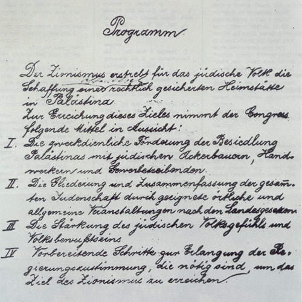
> El **Programa de Basilea**, aprobado por el Primer Congreso Sionista en 1897, en el cual la primera línea declara:  «El sionismo busca establecer un hogar para el pueblo judío en Palestina garantizado por el derecho público».

Herzl imaginó el sionismo con un enfoque socialista, distinto tanto del socialismo clásico de la socialdemocracia alemana como del comunismo. Propuso un socialismo más moderado, basado en la creación de comunidades ([yishuvim](https://es.wikipedia.org/wiki/Yishuv)) donde se compartieran bienes y medios de producción, fomentando así un sentido de comunidad entre los inmigrantes judíos.

## Reacción ultraortodoxa al sionismo

El sionismo implica la creación del Estado de israel por parte del ser humano.

Los ortodoxos van a reaccionar de dos formas:

- Algunos, la minoría, estarán de acuerdo. De hecho, en 1902 van a fundar en Vilna el [***Mizrahi***](https://en.wikipedia.org/wiki/Mizrachi_(political_party)), que además de *oriental* es el acrónimo de ***Merkaz Ruhani*** ("centro espiritual), organización sionista ortodoxa. 
- La inmensa mayoría de ortodoxos se van a agrupar en [**Agudat Israel**](https://es.wikipedia.org/wiki/Agudat_Israel), un partido político claramente establecido con sus estatutos y **antisionista**, porque consideran que el sionismo atrasa el mesianismo: si el ser humano pretende construir el Estado de Israel por sus propios medios, niega el poder/la oportunidad al Mesías que Dios ha prometido enviar. Y Dios considerará que los seres humanos son impíos por no confiar en el mesianismo divino. Aquí se van a agrupar tanto los haredíes (hasidíes y yeshivíes). El partido tuvo bastante fuerza en Polonia, Lituania y luego por supuesto en Israel, ya que participarán en las *aliyot*.

Poco después, en 1922 surgió otro partido (de inmigrantes) ya en Jerusalén: [***HaPoel HaMizrahi***](https://es.wikipedia.org/wiki/HaPoel_HaMizrahi) (*el obrero oriental*). Será un pacto sionista ortodoxo que podemos considerar de centro en el sentido en que no era ni muy conservador ni por supuesto socialista ni nada parecido, aunque tenga en su nombre el término obrero.

Importante porque de estos dos partidos saldrá el **Partido Nacional Sionista** que hoy está en coalición con **Netanyahu** controlando el poder.

En 1937 Agudat Israel, en el apogeo del nazismo, cambia de estrategia. Ante esta circunstancia, A.I. decide colaborar con los sionistas y favorecer la llegada de migración a Palestina. Un grupito no comparte esta medida y funda [***Edah Haredit***](https://es.wikipedia.org/wiki/Edah_Haredit): los haredíes más conservadores cuyo grupo más radical se llama [***Naturei Karta***](https://es.wikipedia.org/wiki/Neturei_Karta) (*guardianes de la ciudad*) y que consideran que hay que colaborar con la Autoridad Palestina, con las organizaciones políticas palestinas. Colaboraron con la [Organización para la Liberación de Palestina](https://es.wikipedia.org/wiki/Organizaci%C3%B3n_para_la_Liberaci%C3%B3n_de_Palestina) (OLP) de [Yasser Arafat](https://es.wikipedia.org/wiki/Yasir_Arafat) y siguen colaborando actualmente con la **Autoridad Nacional Palestina** (ANP). Yasser Arafat les dio el *Ministerio de Asuntos Judíos* en la OLP. Hoy la **ANP** no tiene poder sobre población judía; los colonos no dependen de ellos.

## *Aliyot* del s. XX anteriores a la creación de Israel

Durante el siglo XX se produjeron cuatro *aliyot* más. 

- **La primera (2ª) -> 1904-1915**

    En 1900 se habían creado las *centuras negras* y en este periodo unos 40k judíos del Este se trasladan a Israel y empiezan a usar el hebreo moderno como lengua oficial de la comunidad judía palestina. Crean el primer [kibutz](https://es.wikipedia.org/wiki/Kibutz) en 1909 y la organización del primer cuerpo paramilitar judío: [Hashomer](https://es.wikipedia.org/wiki/Hashomer), *el vigilante*, judíos armados (de ningún Estado, pues aquello aún es territorio otomano).

    En 1917 fueron asesinados unos 125.000 judíos en Ucrania por el [Ejército Blanco](https://es.wikipedia.org/wiki/Ej%C3%A9rcito_Blanco_(Rusia)).

- **La segunda (3ª) -> 1917**

    Unos 35k judíos de Ucrania y Rusia. En pleno contexto de la 1ª Guerra Mundial, los británicos ocupan Palestina, en la lucha contra el Imperio Otomano que se ha aliado a Alemania y Austria. Palestina se convierte en Mandato Británico y se produce la [**Declaración Balfour**](https://es.wikipedia.org/wiki/Declaraci%C3%B3n_Balfour), un ministro británico que promete la creación de un estado judío en Palestina.

- **La tercera (4ª) -> 1923**
    
    Los EEUU cambian su política de migración y restringen la entrada, incluyendo judíos. Hay una mayor migración a Palestina. Hasta entonces, la migración a EEUU era mucho más numerosa que a Palestina. En EEUU eran ya 4 millones, un 3,6% de la población estadounidense, de modo que 40k judíos de Polonia y otros 40k del resto de Europa, Irak y Yemen emigrarían a Palestina.

- **La cuarta (5ª) -> 1929-1939**

    Como consecuencia del nazismo, 225k judíos, sobre todo alemanes emirgaron a Palestina duplicando la población judía. El [***Libro Blanco de 1939***](https://es.wikipedia.org/wiki/Libro_Blanco_de_1939) limitó la inmigración a 75k en cinco años y planteó el objetivo de un Estado único con mayoría árabe.

En 1880 había unos 24.000 judíos en Palestina, un 8% de la población.

En 1946 eran 630.000, un 30% y cientos de miles de supervivientes del holocausto querían emigrar allí. El fenómeno había empezado en el s. XIX y seguía, y seguramente si no hubiera habido holocausto ni II Guerra Mundial se habría producido igualmente.

## Evolución del sionismo (1920-1945)

En 1920, tras un progromo árabe en Jerusalén, Hashomer se transformó en [Haganá](https://es.wikipedia.org/wiki/Hagan%C3%A1) (*la defensa*), que tuvo como líder en los años 30 y 40 al sionista [David Ben Gurión](https://es.wikipedia.org/wiki/David_Ben-Guri%C3%B3n).

En 1931, [Ze'ev (Vladímir) Jabotinsky](https://es.wikipedia.org/wiki/Zeev_Jabotinsky) (un líder de Europa Oriental), admirador de Mussolini, creó la Haganá B, luego [Irgún](https://es.wikipedia.org/wiki/Irg%C3%BAn), grupo paramilitar que cometió numerosos atentados contra los británicos.

Ben Gurión no atenta contra los británicos, *defiende* a los judíos de posibles ataques árabes.

A la muerte de Jabotinsky en 1940 se dividió en

- [**Herut**](https://es.wikipedia.org/wiki/Herut): precursor del [Likud](https://es.wikipedia.org/wiki/Likud), el partido conservador israelí, el sionismo de derechas. Como Jabotinsky admiraba a Mussolini, Gurión se metía con él diciendo que era Vladimir Hitler.
- [**Lehi**](https://es.wikipedia.org/wiki/Leji): un partido racista judío, partidario de colaborar con Hitler durante la II Guerra Mundial.

La división entre Herut y Lehi será precisamente esa. Jabotinsky era partidario de Mussolini pero cuando estalla la II Guerra Mundial en el 39 y Jabotinsky muere, se produce la división por si deben apoyar a los británicos o al Eje. Un grupito minoritario dice que deben apoyar al Eje porque el partido nazi quiere crear un estado alemán racialmente puro y ellos también quieren eso para el pueblo judío. Hitler no les hizo ni puñetero caso y siguió con su plan de exterminio del pueblo judío.

## Antisemitismo francés del XX

En Francia tienen su partido, la *Action Française*, fundado en 1898 por los antidreyfusianos Vaugeois y Pujo.

Se publicó en 1905 el *Précis de l'Affaire Dreyfus*, obra antidreyfusiana firmada por [Henri Dutrait](https://fr.wikipedia.org/wiki/Henri_Dutrait-Crozon), un pseudónimo colectivo de los coroneles Frédéric Delebecque y Georges Larpen, dos militantes de [***Action Française***](https://fr.wikipedia.org/wiki/Action_fran%C3%A7aise) y colaboradores de la Revue d'Action française (que se convirtió en [*L'Action française*](https://fr.wikipedia.org/wiki/L%27Action_fran%C3%A7aise_(quotidien)) bajo la dirección de Charles Maurras en 1908). 

Se trata de una obra que se presenta como un estudio de carácter científico tanto por su minuciosa descripción de los hechos, por sus numerosas citas, su abundante bibliografía como por su amplitud (alrededor de 400 p.) y su índice analítico. El Précis, que responde hábilmente a los criterios de una obra académica y didáctica, es, sin embargo, un amplio alegato antidreyfusiana.

Atentado con bombas fétidas en el estreno de la obra de teatro *L'affaire Dreyfus* de René Kestner (1931).

> ***¿Fuente? No se encuentra ni el autor ni la obra.***

A la muerte de Dreyfus en 1935 la prensa antisemita reivindicó de nuevo su culpabilidad.

## Antisemitismo alemán del XX

En 1919 se funda el Partido Obrero Alemán, en el que ingresa Hitler, quien en 1929 lo transforma en el Partido Nacional Socialista Alemán.

En 1923 fracasa el [Putsch de la Cervecería](https://es.wikipedia.org/wiki/Putsch_de_M%C3%BAnich), que costó ocho meses de cárcel a Hitler en los que escribió [Mein Kampf](https://es.wikipedia.org/wiki/Mi_lucha).

Si en 1929 sólo btuvo un 1,1% de los votos, tras el [Crac de Nueva York](https://es.wikipedia.org/wiki/Crac_del_29) obtuvo el 18,25% en las elecciones de 1930. El 37% en julio del 32 y el 44% en el 33, con Hitler ya como Canciller. Dio un golpe de Estado y al año siguiente se proclamó Führer del [Tercer Reich](https://es.wikipedia.org/wiki/Alemania_nazi).

Crea los **[Escuadrones de Protección](https://es.wikipedia.org/wiki/Schutzstaffel)** (**ϟϟ**):

- **SS-General**: 1925

    Protección de los altos cargos del partido. Dirigida por Himmler desde el 29.

- **SS-Calavera**: 1934

    Dirección de campos de concentración. Dirigida por Glücks desde el 39.

- **SS-Armada**: 1939

    Tropas de élite muy politizadas usadas en el frente. Dirigidas por Dietrich.

En **marzo del 1933** se abrieron 50 campos de concentración (Dachau el primero).

En **abril** se los expulsa de la administración pública.

En **mayo** se queman sus libros.

En **septiembre** se los expulsa de la prensa, el cine y el teatro.

En **1934** se retira la ciudadanía a los judíos.

En **1935** se proclamaron las [Leyes Raciales de Núremberg](https://es.wikipedia.org/wiki/Leyes_de_N%C3%BAremberg).

En **1938** se produjo la [Noche de los cristales rotos](https://es.wikipedia.org/wiki/Noche_de_los_cristales_rotos) (400 sinagogas y 7000 negocios destruidos, 30.000 judíos trasladados a campos).

En **1939** se les expropia oro y plata. Se los traslada a guetos y se les obliga a llevar la [estrella amarilla](https://es.wikipedia.org/wiki/Insignia_amarilla).

## Antisemitismo europeo oriental del XX

En septiembre de 1939 Alemania invade Polonia.

En septiembre del año siguiente se proclama la dictaudra de [Antonescu](https://es.wikipedia.org/wiki/Ion_Antonescu) en Rumanía que firma el [Pacto Tripartito](https://es.wikipedia.org/wiki/Pacto_Tripartito) con Alemania e Italia (la URSS había invadido Moldavia en julio y Hungría Transilvania en agosto).

En enero de 1941 **progromo de Bucarest**, en junio [Operación Barbarroja](https://es.wikipedia.org/wiki/Operaci%C3%B3n_Barbarroja): Alemania ocupa Ucrania excepto Transnistria y Odesa, ocupadas por Rumanía.

En otoño de 1941 masacres de Odesa y de Babi Yar en Kiev (ciudades que tuvieron entre 200k y 300k judíos).

A este fenómeno se le denominó el *Holocausto de las Balas*.

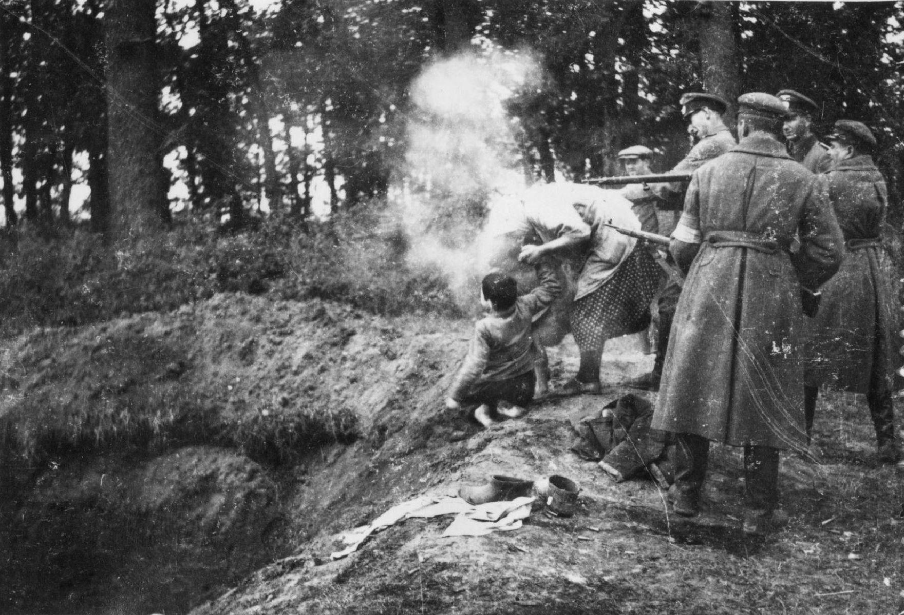

Esta fotografía se ha hecho viral desde que en las últimas décadas del XXI se investigara, por parte de algunos historiadores polacos de izquierda, la participación de autoridades polacas y ucranianas en la persecución de los judíos.

[**Noticia**](https://elpais.com/internacional/2021-02-10/polonia-estrecha-el-cerco-contra-los-historiadores-del-holocausto.html)

## La solución final

[**Conferencia de Wannsee**](https://es.wikipedia.org/wiki/Conferencia_de_Wannsee), enero de 1942.

En esta conferencia, los líderes alemanes deciden la estrategia de los campos de exterminio para los asesinatos en masa de los judíos. Esto supuso el mayor genocidio de la historia de la humanidad.

## Proclamación del Estado de Israel

[Plan de Partición](https://es.wikipedia.org/wiki/Plan_de_las_Naciones_Unidas_para_la_partici%C3%B3n_de_Palestina) aprobado por la Asamblea de la ONU, aprobado el 29 de noviembre del 1947, establece la posibilidad de dos estados, uno árabe (mayoritariamente musulmán) y un estado judío.

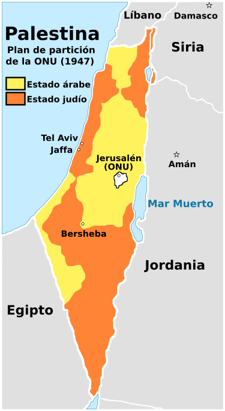

En el mapa vemos el Plan de Folke Bernadotte, el príncipe sueco (de la faimila Bernadotte, de un antiguo general de la familia de Napoleón que se convirtió en rey de Suecia) enviado de la ONU que propuso un Estado Binacional en mayo con estatuto internacional para Jerusalén. 

Tras negociar con unos y otros, resolvió que había que: 

- Otorgar la mayor parte **del territorio poblado** a los árabes (lo amarillo)
- Otorgar a los judíos una parte de la costa palestina con Tel Aviv y Jaffa + una parte de Galilea que estaba muy poblada de judíos desde las migraciones sefardíes a Tiberíades del s. XVI. Y luego, en el sur, el Desierto del Negev, prácticamente deshabitado.
- Crear, para Jerusalén, un estatuto internacional de protección oficial por parte de la ONU. Con tropas de la ONU, se permitiría la asistencia a Jerusalén para judíos, cristianos y musulmanes.

Los árabes rechazaron el plan el 17 de diciembre del 1947 y el 14 de mayo del 1948 Ben-Gurión proclamó el Estado de Israel. Bernadotte fue asesinado por el partido **Lehi**, ese partido fascista judío.

## [Nakba](https://es.wikipedia.org/wiki/Nakba) (1949)

A partir de ese momento se produce el éxodo palestino. 

> Según la Agencia de las Naciones Unidas para los Refugiados Palestinos (UNRWA), son refugiados palestinos las "***personas cuyo lugar de residencia habitual era el mandato británico de Palestina entre junio de 1946 y mayo de 1948 y que perdieron sus casas y medios de vida como consecuencia de la guerra árabe-israelí de 1948***". Dicha definición también incluye a sus descendientes.

Y la [Primera Guerra Árabe-Israelí](https://es.wikipedia.org/wiki/Guerra_%C3%A1rabe-israel%C3%AD_de_1948) (14 de mayo de 1948 - 20 de julio de 1949)

## Aliyá *Alfombra roja*

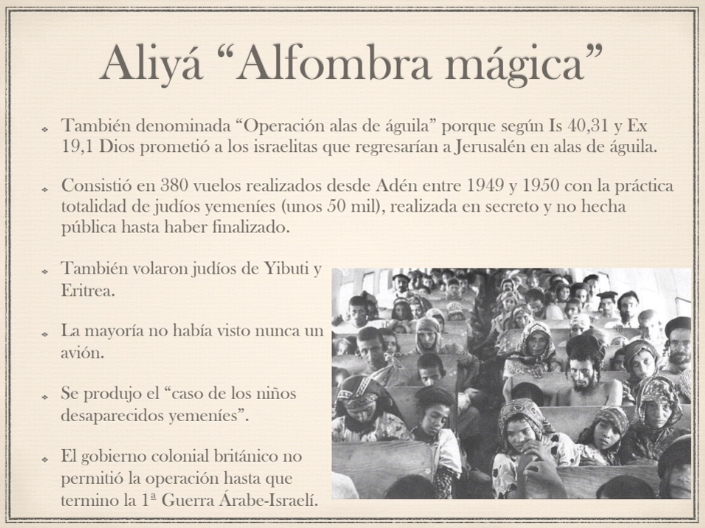

## Aliyá de Babilonia

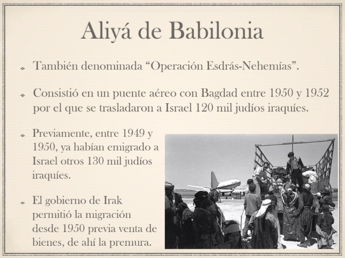

## Aliyot de los Falashas

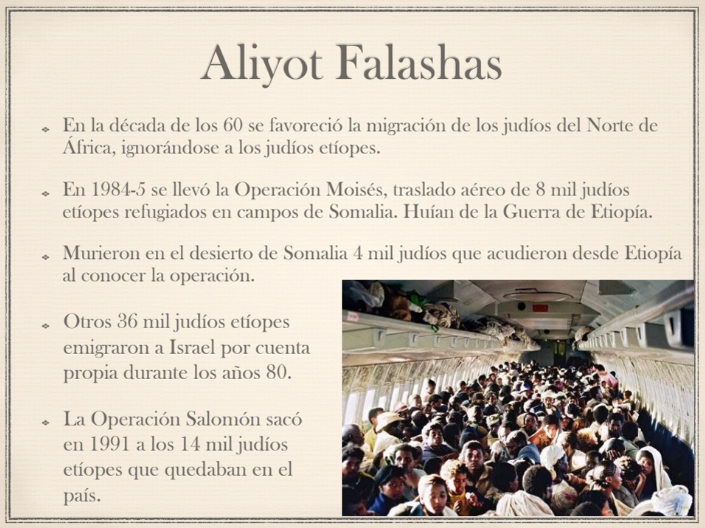

## Evolución del judaísmo reformado en el XX y el XXI

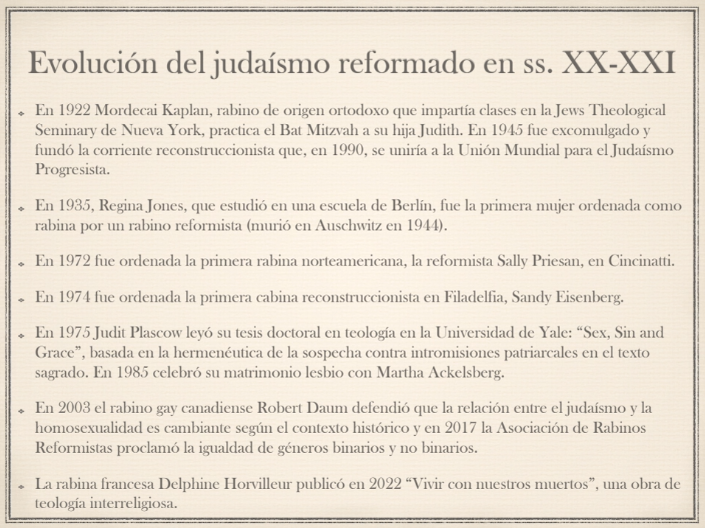

Este hecho del rabino de intentar integrar a las mujeres en un judaísmo más moderno le costó la expulsión de la comunidad. Funda el reconstruccionismo: una corriente judía que admite que se puede ser judío de múltiples maneras, incluso ateo.

Evolución de las mujeres en el jdmo reformista: Regina Jones 1935 ordenada primera rabina. Luego ya, a partir de los 70 con esa ola nueva de feminismo mundial. 

## Evolución de la ultraortodoxia (1948-)

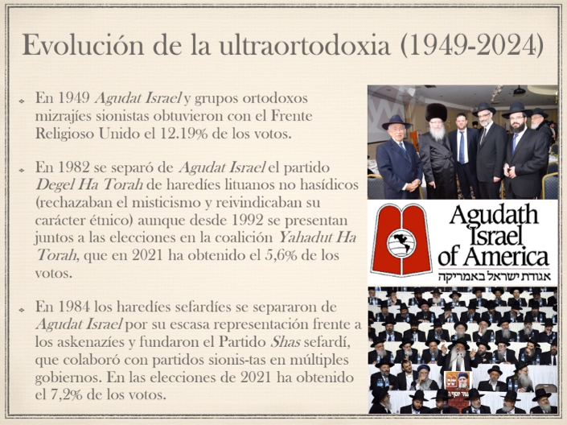

## Evolución del sionismo (1949-2024)

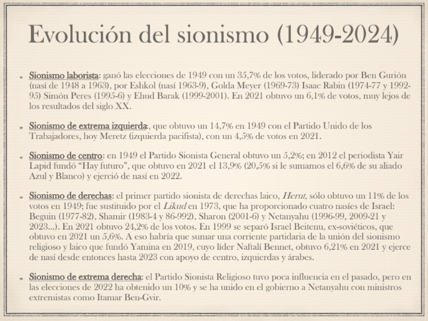

## Evolución de la sociedad israelí

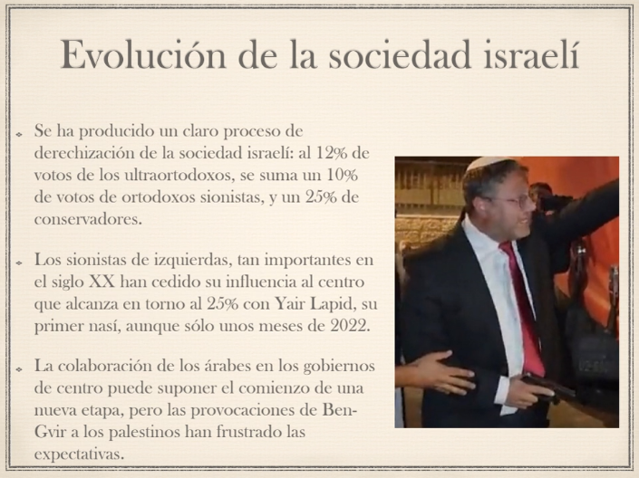

Ahora hasta van a los mítines con pistola.

## Conflicto palestino-israelí (1947-2024)

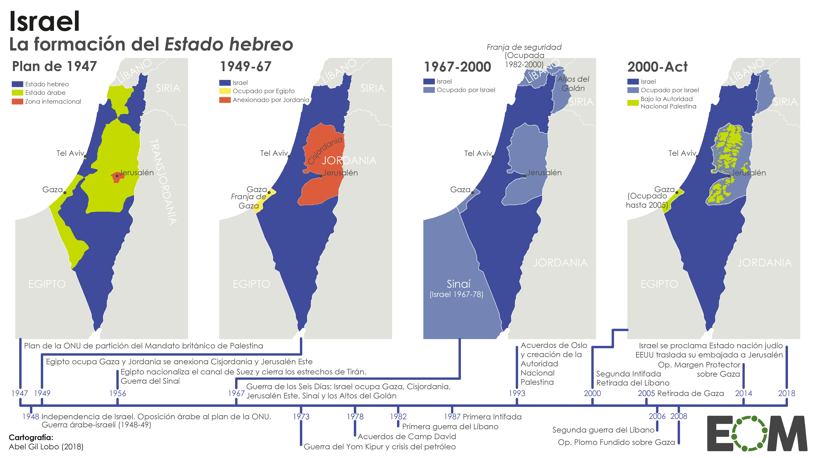

[**Acuerdos de Abrahám**](https://es.wikipedia.org/wiki/Acuerdo_de_normalizaci%C3%B3n_de_las_relaciones_entre_Emiratos_%C3%81rabes_Unidos_e_Israel)

