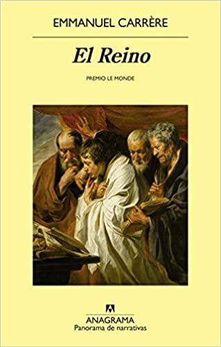
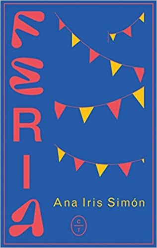
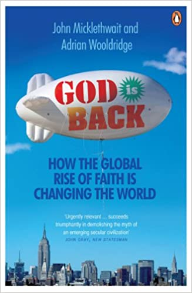
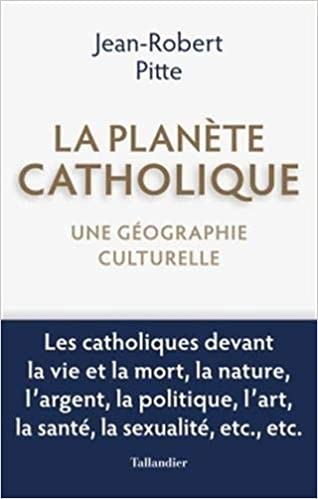
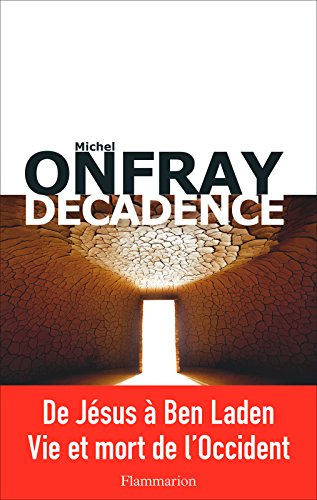
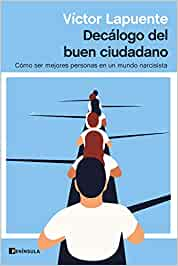
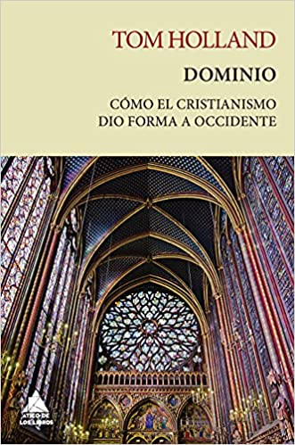

# Influencia del cristianismo en la sociedad del siglo XXI

## 1. *El reino* - Emmanuel Carrère

- **Editorial**: Anagrama
- **Año**: 2014
- **Descripción**:
    Hace ya tiempo que Emmanuel Carrère ha acostumbrado a sus lectores a esperar de él lo inesperado, y en esta obra monumental, casi diríamos épica y sin duda radical, aborda nada menos que la fe y los orígenes del cristianismo. En sus páginas se entrecruzan dos tramas, dos tiempos: la propia vivencia del autor, que abraza la fe en un momento de crisis personal marcado por una compleja relación amorosa y el abuso del alcohol, y la historia de Pablo el Converso y de Lucas el Evangelista. Pablo que cae del caballo, tiene una iluminación mística y pasa de lapidador de cristianos a propagador de la nueva fe que transmuta todos los valores. Y Lucas que escribe la vida de Jesús y a partir del cual nos adentramos en los evangelios primigenios, tan diferentes al Apocalipsis de fuegos artificiales de Juan. En estas dos historias entrecruzadas sobre la fe se suceden abundantes personajes, episodios y reflexiones: la serie televisiva sobre muertos que resucitan en la que participa Carrère como guionista, la canguro ex hippie y amiga de Philip K. Dick a la que contrata, los bolcheviques con los que compara a los primeros cristianos, webs porno, visiones eruditas sobre las fuentes originales del cristianismo, la desaparición –¿resurrección?– del cadáver de Jesús... Lo que a Carrère le interesa del cristianismo es su mensaje de transgresión de lo establecido y la desmesura de la fe. Y este libro provocador y deslumbrante es una indagación rabiosamente contemporánea sobre el cristianismo que nos habla de la perplejidad, el dogma, la duda, la redención y la construcción de una fe con mensajes rupturistas y extraños rituales.

## 2. *Feria* - Ana Iris Simón

- **Editorial**: Círculo de Tiza
- **Año**: 2020
- **Descripción**:
    «Tendré que llevarte al cerro de la Virgen y tendré que decirte que eso es La Mancha y que es de esa tierra naranja de donde venimos, que ese manto de esparto que no acaba nunca es lo que eres. Tendré que explicarte lo que es un Pueblo y sabrás que el nuestro está atravesado por tres realidades: la ausencia total de relieve, el Quijote y el viento. Tendré que recordarte que eres nieto de familia postal, bisnieto de campesinos y feriantes, tataranieto de carabinero exiliado y de quincallera, y que sientas entonces que eres heredero de una raza mítica».
    Ana Iris creció escuchando a sus abuelos el relato de dos mundos que se desvanecen. Unos, feriantes, quejándose de que cada vez tenían más trampas y menos perras, porque a medida que la vida se convertía en una feria —la de las vanidades—, la auténtica feria dejaba de tener sentido. Los otros abuelos, campesinos, le transmitieron el arraigo mágico de la tierra. Y fue ese abuelo el que la llevó un día a un almendro y le dijo que lo había plantado él, así que pa ella era su sombra.
    La que cabía en la foto que llevaba su abuelo en la cartera con un gitano a un lado y al otro un Guardia Civil. Un relato deslenguado y directo de un tiempo no tan lejano en el que importaba más que los niños disfrutaran tirando petardos que el susto que se llevasen los perros.
    También es una advertencia de que la infancia rural, además de respirar aire puro, es conocer la ubicación del puticlub y reírse con el tonto del pueblo. Un repaso a las grietas de la modernidad y una invitación a volver a mirar lo sagrado del mundo: la tradición, la estirpe, el habla, el territorio. Y a no olvidar que lo único que nos sostiene es, al fin, la memoria.
    Feria es una oda salvaje a una España que ya no existe, que ya no es.

## 3. *God is Back: How the Global Rise of Faith is Changing the World* - John Micklethwait & Adrian Wooldridge

- **Editorial**: Penguin
- **Año**: 2010
- **Descripción**:
    As the world becomes more modern, it is not becoming more secular. Instead, on the street and in the corridors of power, religion is surging. As *God is Back* shows, for better or for worse, faith is on the increase - fuelled by an American-style model of personal, customer-driven, aggressively marketed religion.
    Shining a light on this huge, hidden world of faith, from Californian megachurches to exorcisms in Sao Paulo, from China's aspirant middle-class Christians to mosques in Nigeria, this book shows that if you want to understand the modern world, you cannot afford to ignore God - whether you believe in Him or not.

## 4. *La planètte catholique. Une géographie culturelle* - Jean-Robert Pitte

- **Editorial**: Editions Tallandier
- **Año**: 2020
- **Descripción**:
    Plus d'un milliard d'hommes sont façonnés par une foi universelle, encadrés spirituellement par une hiérarchie sacerdotale, professant le même Credo, guidés par un pasteur unique, l'évêque de Rome. Cela leur confère d'évidentes particularités culturelles : ils ne répugnent pas à se laisser conduire et se méfient des excès du libre arbitre. Au sein même du christianisme, on n'entretient pas les mêmes relations entre hommes, femmes et enfants nés ou à naître, on ne dort pas tout à fait de la même façon, on ne regarde pas l'argent du même oeil, on n'apprécie pas les mêmes vins, on ne bâtit pas les mêmes villes, on n'installe pas les mêmes cimetières, on n'a pas la même attitude face à la nature, selon que l'on est catholique ou protestant, etc. L'ancrage de l'Occident méridional dans la foi et la culture catholiques a joué un rôle crucial dans l'organisation de l'espace, dans les paysages et l'architecture, dans les pratiques sociales, par exemple dans la conception de la sexualité ou de l'alimentation. Partout, les catholiques sont à la fois divers et semblables. Certains vivent en terre de vieille chrétienté, dans des régions évangélisées à l'époque moderne (Amérique latine, Philippines...) et d'autres encore appartiennent à des contrées qui étaient, il y a peu, des pays de mission (Afrique, Océanie...). Aujourd'hui, le catholicisme a beau reculer dans les coeurs et les intelligences des Européens, il marque toujours leurs mentalités et leurs habitudes. Le grand spécialiste de géographie culturelle qu'est Jean-Robert Pitte montre et explique les manières dont se croisent, sur le terrain, cette foi universelle et les coutumes propres à tous les groupes humains. Il illustre son propos par une quarantaine de cartes et une vingtaine de reproductions d'oeuvres d'art qui éclairent une démarche tout à fait nouvelle.

## 5. *Décadence* - Michel Onfray

- **Editorial**: Flammarion
- **Año**: 2017
- **Descripción**:
    «Chacun connaît les pyramides égyptiennes, les temples grecs, le forum romain et convient que ces traces de civilisations mortes prouvent... que les civilisations meurent – donc qu’elles sont mortelles! Notre civilisation judéo-chrétienne vieille de deux mille ans n’échappe pas à cette loi.
    Du concept de Jésus, annoncé dans l’Ancien Testament et progressivement nourri d’images par des siècles d’art chrétien, à Ben Laden qui déclare la guerre à mort à notre Occident épuisé, c’est la fresque épique de notre civilisation que je propose ici.
    On y trouve : des moines fous du désert, des empereurs chrétiens sanguinaires, des musulmans construisant leur "paradis à l’ombre des épées", de grands inquisiteurs, des sorcières chevauchant des balais, des procès d’animaux, des Indiens à plumes avec Montaigne dans les rues de Bordeaux, la résurrection de Lucrèce, un curé athée qui annonce la mort de Dieu, une révolution jacobine qui tue deux rois, des dictatures de gauche puis de droite, des camps de la mort bruns et rouges, un artiste qui vend ses excréments, un écrivain condamné à mort pour avoir écrit un roman, deux jeunes garçons qui se réclament de l’islam et égorgent un prêtre en plein office – sans parler de mille autres choses...
    Ce livre n’est ni optimiste ni pessimiste, mais tragique car, à cette heure, il ne s’agit plus de rire ou de pleurer, mais de comprendre.»

## 6. *Decálogo del buen ciudadano* - Víctor Lapuente

- **Editorial**: Ediciones Península
- **Año**: 2021
- **Descripción**:
    La base para una ética del siglo XXI se encuentra en las enseñanzas de los hombres y las mujeres sabias que desde la Antigüedad han reflexionado sobre cómo sobreponerse a la fatalidad y vivir una vida virtuosa, en la que los proyectos trascendentes se impongan a los deseos inmediatos.
    Víctor Lapuente deja a un lado el análisis de los desafíos de la sociedad para centrarse en los de un individuo perdido y angustiado en la era del selfi. Con un estilo claro, trenzando anécdotas históricas y ejemplos didácticos, se lanza a la tarea de rescatar las gemas de esos pensadores clásicos y proponer una ética a la altura de los retos a los que nos enfrentamos.
    Enemigo de la autoayuda y las soluciones milagrosas, Lapuente defiende la necesidad de tomar el camino más exigente para alcanzar el equilibrio personal: el que pasa por cuestionarnos a nosotros mismos y nos empuja a rebelarnos contra la pereza, la vanidad y el victimismo. Su *Decálogo del buen ciudadano* propone diez reglas que se resumen en la necesidad de asumir un peso que, más que hundirnos, nos eleve por encima del vacío.

## 7. *Manicomio de verdades* - Rémi Brague

- **Editorial**: Encuentro
- **Año**: 2021
- **Descripción**:
    En este libro, el filósofo francés Rémi Brague señala cuál es el problema fundamental de la modernidad: ha dejado de considerar el mundo creado y la humanidad como intrínsecamente valiosos. En vista de ello, el autor explora en *Manicomio de verdades* la idea de que la humanidad debe regresar a la Edad Media. No la Edad Media del presunto atraso y barbarie, sino una Edad Media que entendía la creación --incluidos los seres humanos-- como el producto de un Dios inteligente y bondadoso. Los desarrollos positivos que se han producido dentro del proyecto moderno ya no se basan en un proyecto racional porque la existencia humana en sí ha dejado de ser el bien que alguna vez fue. Brague se remite a nuestros antepasados intelectuales del mundo medieval para presentar un argumento razonado de por qué la humanidad y las civilizaciones son bienes que vale la pena promover y preservar. «¿Qué pasa con las virtudes o ideas --o más bien verdades-- que [la modernidad] ha llevado a la locura? Mi tesis es que hay que liberarlas de la camisa de fuerza, sacarlas del manicomio y devolverles su cordura y dignidad» (Rémi Brague).

## 8. *Dominio: una nueva historia del cristianismo* - Tom Holland

- **Editorial**: Ático de los Libros
- **Año**: 2020
- **Descripción**:
    La fascinante historia de cómo la revolución cristiana cambió el mundo. El cristianismo es el legado más influyente y duradero de la Antigüedad, y su surgimiento constituye la revolución más radical que ha conocido la historia de Occidente. El impacto de la religión cristiana ha dejado huella en todos los campos del desarrollo humano. En consecuencia, a pesar del creciente número de personas que abandonan esta fe en la actualidad, vivir en un país moderno es vivir en una sociedad cuyos instintos y tradiciones tienen unas profundas raíces cristianas. En *Dominio*, el historiador Tom Holland narra, con su habitual erudición y elegancia, cómo hemos llegado al presente y cómo se ha forjado la mente occidental en el contexto histórico más amplio. En un revelador análisis que abarca desde la invasión persa de Grecia en el 480 a. C. hasta las crisis migratorias de la Europa actual, desde Nabucodonosor y los primeros días de la Iglesia a los Beatles, el movimiento feminista y el Estado Islámico, Holland explora por qué el cristianismo ha sido y es una fuerza revolucionaria y cómo ha transformado radicalmente lo que significa ser humano.
